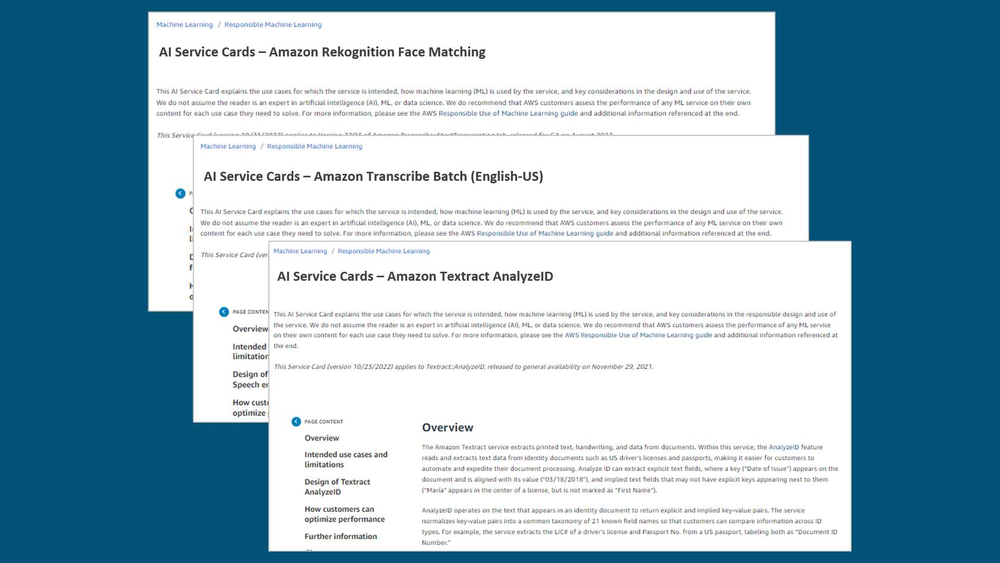
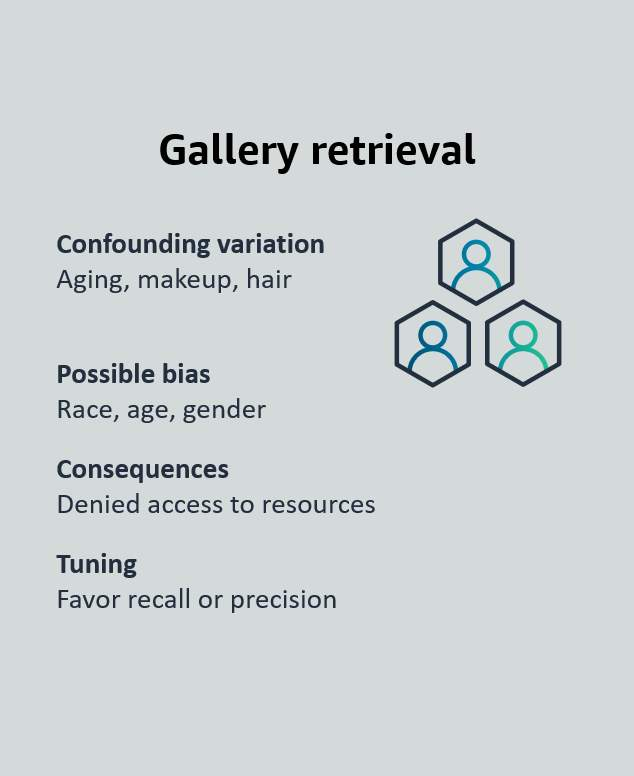
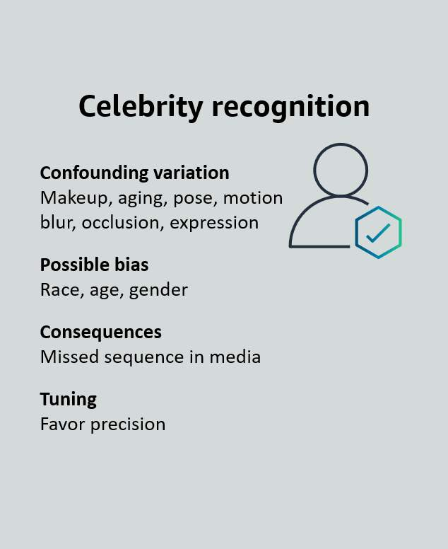
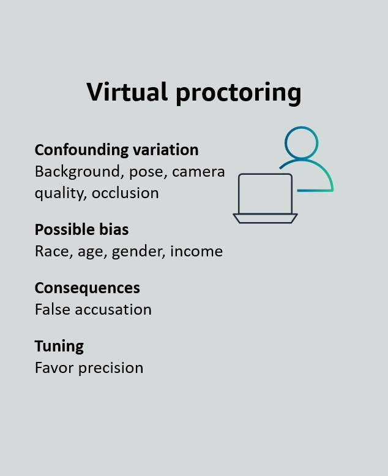
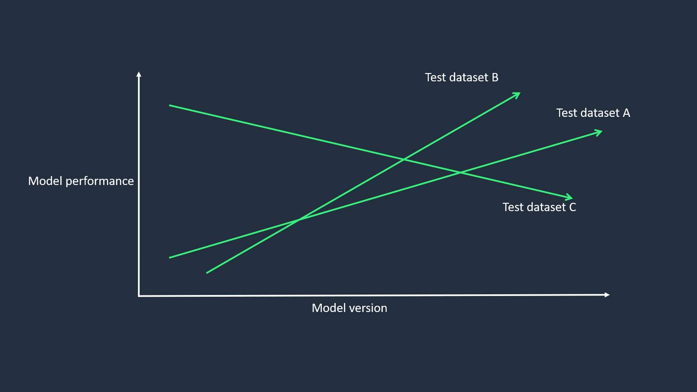
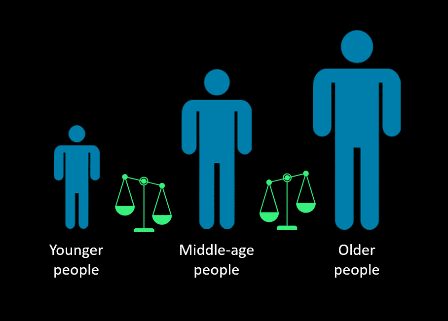

# Amazon Services and Tools for Responsible AI
As the leader in cloud technologies, AWS offers services like Amazon SageMaker AI and Amazon Bedrock that have built-in tools to help you with responsible AI. These tools cover topics such as foundation model evaluation, safeguards for generative AI, bias detection, model prediction explanations, monitoring and human reviews, and governance improvement.

## Amazon SageMaker AI
**Amazon SageMaker AI** is a fully managed ML service. With SageMaker AI, data scientists and developers can quickly and confidently build, train, and deploy ML models into a production-ready hosted environment. It provides a UI experience for running ML workflows that makes SageMaker AI ML tools available across multiple integrated development environments (IDEs).

With SageMaker AI, you can store and share your data without having to build and manage your own servers. This gives you or your organization more time to collaboratively build and develop your ML workflow and do it sooner. SageMaker AI provides managed ML algorithms to run efficiently against extremely large data in a distributed environment. With built-in support for bring-your-own-algorithms and frameworks, SageMaker AI offers flexible distributed training options that adjust to your specific workflows. Within a few steps, you can deploy a model into a secure and scalable environment from the SageMaker AI console.

## Amazon Bedrock
**Amazon Bedrock** is a fully managed service that makes available high-performing FMs from leading AI startups and Amazon for your use through a unified API. You can choose from a wide range of FMs to find the model that is best suited for your use case. 

Amazon Bedrock also offers a broad set of capabilities to build generative AI applications with security, privacy, and responsible AI. 

With the serverless experience of Amazon Bedrock, you can privately customize FMs with your own data and securely integrate and deploy them into your applications by using AWS tools without having to manage any infrastructure.

# Reviewing Amazon service tools for responsible AI 
Next, you will look at Amazon service tools that can help you with different areas of responsible AI. These areas include FM evaluation, safeguards for generative AI, bias detection, model prediction explanation, monitoring and human reviews, and governance improvement.

## Foundation model evaluation

You should always evaluate a FM to determine if it will it is suited for your specific use case. To help you do this, Amazon offers model evaluation on Amazon Bedrock and Amazon SageMaker AI Clarify.

### Model Evaluation On Amazon Bedrock
With Model evaluation on Amazon Bedrock, you can evaluate, compare, and select the best foundation model for your use case in just a few clicks. Amazon Bedrock offers a choice of automatic evaluation and human evaluation. 

Automatic evaluation offers predefined metrics such as accuracy, robustness, and toxicity. 

Human evaluation offers subjective or custom metrics such as friendliness, style, and alignment to brand voice. For human evaluation, you can use your in-house employees or an AWS-managed team as reviewers.

### Amazon SageMaker AI Clarify
SageMaker AI Clarify supports FM evaluation. You can automatically evaluate FMs for your generative AI use case with metrics such as accuracy, robustness, and toxicity to support your responsible AI initiative. 

For criteria or nuanced content that requires sophisticated human judgment, you can choose to use your own workforce or use a managed workforce provided by AWS to review model responses.

## Safeguards for generative AI

With Guardrails for Amazon Bedrock, you can implement safeguards for your generative AI applications based on your use cases and responsible AI policies. Guardrails helps control the interaction between users and FMs by filtering undesirable and harmful content, redacting personally identifiable information (PII), and enhancing content safety and privacy in generative AI applications. You can create multiple guardrails with different configurations tailored to specific use cases. Additionally, you can continuously monitor and analyze user inputs and FM responses that can violate customer-defined policies in the guardrails.

### Consistent level of AI safety
Guardrails for Amazon Bedrock evaluates user inputs and FM responses based on use case specific policies and provides an additional layer of safeguards regardless of the underlying FM. Guardrails for Amazon Bedrock can be applied across FMs, including Anthropic Claude, Meta Llama 2, Cohere Command, AI21 Labs Jurassic, Amazon Titan Text, and fine-tuned models. Customers can create multiple guardrails, each configured with a different combination of controls, and use these guardrails across different applications and use cases. Guardrails for Amazon Bedrock can also be integrated with Agents for Amazon Bedrock to build generative AI applications aligned with your responsible AI policies.

### Block undesirable topics
Organizations recognize the need to manage interactions within generative AI applications for a relevant and safe user experience. They want to further customize interactions to remain on topics relevant to their business and align with company policies. By using a short, natural language description, Guardrails for Amazon Bedrock gives you the ability to define a set of topics to avoid within the context of your application. Guardrails for Amazon Bedrock detects and blocks user inputs and FM responses that fall into the restricted topics. For example, a banking assistant can be designed to avoid topics related to investment advice.

### Filter harmful content
Guardrails for Amazon Bedrock provides content filters with configurable thresholds to filter harmful content across hate, insults, sexual, and violence categories. Most FMs already provide built-in protections to prevent the generation of harmful responses. In addition to these protections, Guardrails for Amazon Bedrock gives you the ability to configure thresholds across the different categories to filter out harmful interactions. Guardrails for Amazon Bedrock automatically evaluates both user queries and FM responses to detect and help prevent content that falls into restricted categories. For example, an ecommerce site can design its online assistant to avoid using inappropriate language such as hate speech or insults.

### Redact PII to protect user privacy
Guardrails for Amazon Bedrock helps you detect PII in user inputs and FM responses. Based on the use case, you can selectively reject inputs containing PII or redact PII in FM responses. For example, you can redact users’ personal information while generating summaries from customer and agent conversation transcripts in a call center.

## Bias detection
SageMaker AI Clarify helps identify potential bias in machine learning models and datasets without the need for extensive coding. You specify input features, such as gender or age, and SageMaker AI Clarify runs an analysis job to detect potential bias in those features. SageMaker AI Clarify then provides a visual report with a description of the metrics and measurements of potential bias so that you can identify steps to remediate the bias.

You can use Amazon SageMaker Data Wrangler to balance your data in cases of any imbalances. SageMaker Data Wrangler offers three balancing operators: random undersampling, random oversampling, and Synthetic Minority Oversampling Technique (SMOTE) to rebalance data in your unbalanced datasets.

## Model prediction explanation
SageMaker AI Clarify is integrated with Amazon SageMaker AI Experiments to provide scores detailing which features contributed the most to your model prediction on a particular input for tabular, natural language processing (NLP), and computer vision models. For tabular datasets, SageMaker AI Clarify can also output an aggregated feature importance chart that provides insights into the overall prediction process of the model. These details can help determine if a particular model input has more influence than expected on overall model behavior.

## Monitoring and human reviews
* **Amazon SageMaker Model Monitor:** monitors the quality of SageMaker AI machine learning models in production. You can set up continuous monitoring with a real-time endpoint (or a batch transform job that runs regularly), or on-schedule monitoring for asynchronous batch transform jobs. With SageMaker Model Monitor, you can set alerts that notify you when there are deviations in the model quality. With early and proactive detection of these deviations, you can take corrective actions.

* **Amazon Augmented AI (Amazon A2I)** is a service that helps build the workflows required for human review of ML predictions. Amazon A2I brings human review to all developers and removes the undifferentiated heavy lifting associated with building human review systems or managing large numbers of human reviewers.

## Governance improvement

SageMaker AI provides purpose-built governance tools to help you implement AI responsibly. These tools give you tighter control and visibility over your AI models. You can capture and share model information and stay informed on model behavior, like bias, all in one place.

Governance tools include the following:

* **Amazon SageMaker Role Manager:** With SageMaker Role Manager, administrators can define minimum permissions in minutes. 

* **Amazon SageMaker Model Cards:** With SageMaker Model Cards, you can capture, retrieve, and share essential model information, such as intended uses, risk ratings, and training details, from conception to deployment. 

* **Amazon SageMaker Model Dashboard:** With SageMaker Model Dashboard, you can keep your team informed on model behavior in production, all in one place.

## Providing transparency
AWS AI Service Cards are a new resource to help you better understand AWS AI services. AI Service Cards are a form of responsible AI documentation that provides a single place to find information on the intended use cases and limitations, responsible AI design choices, and deployment and performance optimization best practices for AWS AI services.

They are part of a comprehensive development process to build AWS services in a responsible way that addresses the core dimensions of responsible AI.

Each AI Service Card contains four sections that cover the following:

* Basic concepts to help customers better understand the service or service features

* Intended use cases and limitations

* Responsible AI design considerations

* Guidance on deployment and performance optimization

The content of the AI Service Cards addresses a broad audience of customers, technologists, researchers, and other stakeholders. This content helps these audiences better understand key considerations in the responsible design and use of an AI service.

# Responsible Considerations to Select a Model
Selecting a model is one of the first and most critical steps to developing an AI system. Model selection has strategic implications for how the AI system will perform. Everything from user experience and go-to-market to hiring and profitability can be affected by selecting the right model for your use case. 

Remember that you can use Model evaluation on Amazon Bedrock or SageMaker AI Clarify to evaluate models for accuracy, robustness, toxicity, or nuanced content that requires human judgement.

## Define application use case narrowly
When selecting a model for your AI application, you must narrowly define your use case. This is important because you can tune your model for that specific use case.

**Example: Defining application use case narrowly for traditional AI**

In this example, you might have an AI application that uses face recognition. Face recognition is not a use case; it is a technology. The way your model applies that technology is a use case. 

Gallery retrieval

Celebrity recognition

Virtual proctoring

For example, a gallery retrieval application might be used to help find missing persons. In this case, you would need a model that can be tuned for favor recall or precision. Favor recall would bring up many results that could be beneficial to the use case of the AI application used in finding missing persons. 

However, if your AI application is being used for celebrity recognition or virtual proctoring, the model would only need to favor precision. This is because the favor recall tuning would provide too many results to be beneficial to the use case of the application. 

**Example: Defining application use case narrowly for generative AI**

In this example, you might have an AI application to assist customers in shopping on your online store. The use case might be to provide a product catalog or to persuade customers to buy products. An appropriate model would need to be selected based on the narrowly defined use case

| Features | Catalog a product	| Persuade to buy |
|----------|--------------------|-----------------|
| Target audience | Broad demographic	| Narrow demographic |
| Possible issues | Veracity | Veracity, unwanted bias, toxicity, detail |
| Consequences | Brand damage, lost sales, and returns | Representative harm, brand damage, lost sales, and returns |
| Tuning | Favors neutrality, clarity, and completeness | Focuses on highest interest problem and benefit to group |

In an AI application to catalog a product, you would want a broad demographic target audience so that it is available for all of your customers. 

In an AI application to persuade to buy, you would want a narrow target audience to capture a specific group of people. For example, you might want to target an audience that lives on the coast to buy accessories for docking boats.

## Choosing a model based on performance
Model performance varies across a number of factors, including the following: 

* Level of customization – The ability to change a model’s output with new data ranging from prompt-based approaches to full model retraining
* Model size – The amount of information the model has learned as defined by parameter count
* Inference options – From self-managed deployment to API calls
* Licensing agreements – Some agreements can restrict or prohibit commercial use
* Context windows – The amount of information that can fit in a single prompt
* Latency – The amount of time it takes for a model to generate an output

**Consider a model based on performance with test datasets**
A common mistake when choosing a model is to assume that the model, in and of itself, is either good or bad. This is not the case. Performance is a function of the model and a test dataset, not just the model. So, when you are assessing a model, you need to determine how well a model performs on a particular dataset.

Model that performs differently on different datasets

For example, a model might perform well on test dataset A over a period of time. The model might perform even better on test dataset B. However, the model might progressively get worst on test dataset C.

This means that you need to consider two development trajectories: the development trajectory of the model and the development trajectory of the datasets. Remember the dataset is not necessarily constant. It is often evolving.

## Choosing a model based on sustainability concerns
Sustainability in the context of responsible AI refers to the ability of AI systems to be developed and deployed in a way that is socially, environmentally, and economically sustainable over the long term. 

Responsible agency considerations for selecting a model

Responsible agency in responsible AI refers to an AI system's capacity to make good judgments and act in a socially responsible manner. The following are key aspects of moral agency for AI.

**Value alignment**
Value alignment is being able to understand, evaluate, and make decisions based on moral principles rather than pure utility maximization. This requires value alignment between the AI system's goals and values and the responsible human values. 

**Responsible reasoning skills**
Responsible reasoning skills is being able to logically think through moral dilemmas and weigh various responsible considerations when making decisions. The AI needs logic and reasoning capabilities to apply responsible principles to novel situations. 

The AI system should have the capacity to engage in responsible reasoning and understand moral concepts, principles, and frameworks. It should be able to apply them in context to specific situations.

**Appropriate level of autonomy**
The AI system should have the appropriate level of autonomy, with clear boundaries and mechanisms for human oversight and intervention, particularly in high-stakes or sensitive domains.

**Transparency and accountability**
The AI system should be transparent about its decision-making process. It should allow external oversight and accountability to ensure its actions are responsibly justified.

Overall, responsible agency requires AI to have sophisticated intelligence on par with human-level cognition to properly apply ethical reasoning in the real world. This remains an immense challenge for current AI.

**Environmental considerations for selecting a model**
When you are developing and deploying AI systems, use environmental considerations as you implement responsible AI.
The following are key environmental challenges and solutions to consider when choosing a model.

**Energy consumption**
| Challenge	                                     | Solution                             |
|------------------------------------------------|--------------------------------------|
| Training large AI models and running them at scale can consume significant amounts of energy and contribute to greenhouse gas emissions and environmental impact.              | The solution is to optimize energy efficiency in AI systems, use renewable energy sources where possible, and consider the overall carbon footprint of AI operations. |

**Resources utilization**
| Challenge	                                     | Solution                             |
|------------------------------------------------|--------------------------------------|
| AI systems often require substantial computational resources, including specialized hardware, such as GPUs and TPUs, and data center infrastructure. The manufacturing and disposal of these resources can have environmental impacts. | Responsible AI should aim to maximize resource efficiency, promote hardware reusability and recyclability, and minimize electronic waste. |

**Environmental impact assessment**
| Challenge	                                     | Solution                             |
|------------------------------------------------|--------------------------------------|
| Before deploying AI systems, it is important to assess their potential environmental impacts, both direct (for example, energy consumption and resource usage) and indirect (for example, enabling or promoting environmentally harmful activities). | Environmental impact assessments should be conducted, and mitigation strategies should be implemented if necessary. |

**Economic considerations for selecting a model**
Economic considerations in responsible AI include the potential benefits and costs of AI technologies and the impact on jobs and the economy. 

For example, AI can automate certain tasks and improve efficiency, but it can also lead to job displacement and inequality. Additionally, there are concerns about the concentration of power and data in the hands of a few companies, which could lead to monopolies and further inequality.

# Responsible Preparation for Datasets
An essential requirement of responsible AI is to prepare your datasets responsibly. This means that you need to have balanced datasets to train your models. 

Remember that you can use SageMaker AI Clarify and SageMaker Data Wrangler to help balance your datasets.

## Balancing datasets
Balanced datasets are important for creating responsible AI models that do not unfairly discriminate or exhibit unwanted biases. 

Balanced datasets should represent all groups of people or data topics. This means that the dataset should contain an adequate number of examples or instances of each group to ensure that the model is not biased towards any particular group or factor. The concept of balanced datasets is particularly important in applications like hiring, lending, or criminal justice, where fairness and equity are essential.

To achieve balanced datasets, the data collected needs to be inclusive and diverse, and the data also needs to be curated to optimize it for training.

**Inclusive and diverse data collection**
Inclusiveness and diversity in data collection ensure that data collection processes are fair and unbiased. Data collection should accurately reflect the diverse perspectives and experiences required for the use case of the AI system. This includes a diverse range of sources, viewpoints, and demographics. By doing this, the AI system can work to ensure decisions are unbiased in their performance.

For example, if an ML model is trained primarily on data from middle-aged individuals, it might be less accurate when making predictions involving younger and older people. Therefore, the datasets should be collected so that age groups are equally represented.

Example that shows bias towards middle-aged people

Inclusiveness and diversity in data collection is a primary concern for data that focuses on people. This is because alienating groups of people in the training data can lead to societal harms and legal repercussions. However, inclusiveness and diversity in data collection should be a primary focus regardless of the topic. For example, collection of data for people, scientific research, geography, weather, products, and other topics should be collected with a focus on the diverse range for each topic.

By promoting inclusiveness and diversity within AI, organizations can promote fairness, transparency, and accountability in their AI systems and contribute to the responsible development of AI technology.

**Data curation**
The second part of balancing the datasets involves curation of the datasets. Curating datasets is the process of labeling, organizing, and preprocessing the data so that it can perform accurately on the model. The curation can help to ensure that the data is representative of the problem at hand and free of biases or other issues that can impact the accuracy of the AI model. Curation helps to ensure that AI models are trained and evaluated on high-quality, reliable data that is relevant to the task they are intended to perform. 

The main steps of curating data include data preprocessing, data augmentation, and regular auditing.

* **Data preprocessing**
Preprocess the data to ensure it is accurate, complete, and unbiased. Techniques such as data cleaning, normalization, and feature selection can help to eliminate biases in the dataset
* **Data augmentation**
Use data augmentation techniques to generate new instances of underrepresented groups. This can help to balance the dataset and prevent biases towards more represented groups.
* **Regular auditing**
Regularly audit the dataset to ensure it remains balanced and fair. Check for biases and take corrective actions if necessary.

**Balance your data for the intended use case**
The use case for the AI system will determine how the data needs to be balanced. For example, if you are creating an AI system about cancer in children, you would collect the data and curate it to focus on children and not include datasets on adults. 
