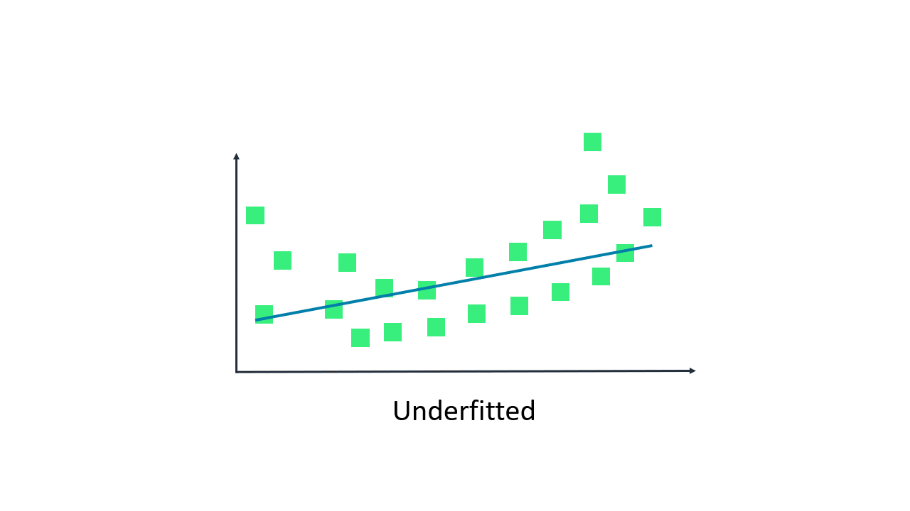
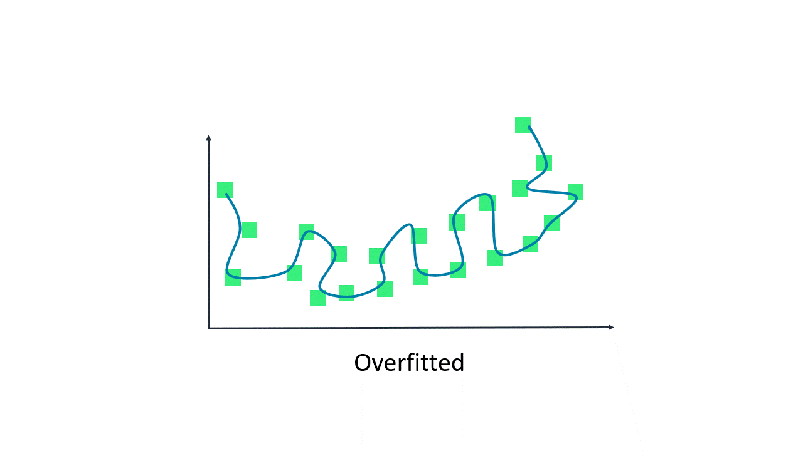
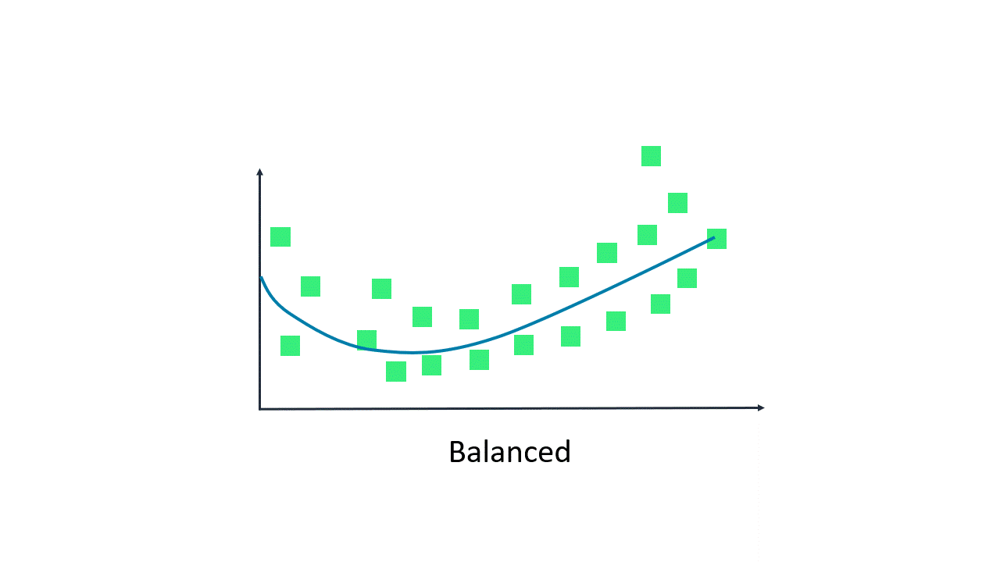
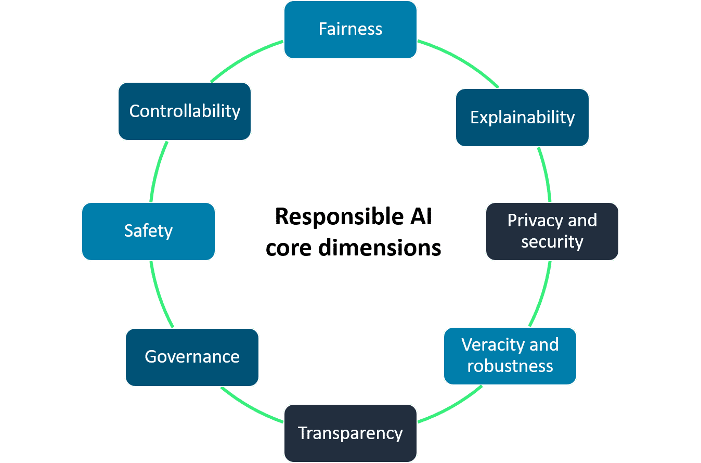

# Responsible Artificial Intelligence Practices
In this course, you will learn about responsible artificial intelligence (AI) practices. 

In the first section of this course, you will be introduced to what responsible AI is. You will learn how to define responsible AI, understand the challenges that responsible AI attempts to overcome, and explore the core dimensions of responsible AI.

Then in the next section of the course, you will dive into some topics for developing responsible AI systems. In this section of the course, you will learn about the services and tools that AWS offers to help you with responsible AI. You will also learn about responsible AI considerations for selecting a model and preparing data for your AI systems.

Finally, in the last section of the course, you learn about transparent and explainable models. You will learn what it means for a model to be transparent and explainable. You will also learn about tradeoffs to consider between safety and transparency for an AI model and the principles of human-centered design for explainable AI.

# Responsible AI
Responsive AI refers to principles and practices that ensures that AI systems are transparent and trustworthy while mitigating potential risks and navigating outcomes. These responsible standards should be considered throughout the entire lifecycle of an AI application. This includes the initial design, development, deployment, monitoring, and evaluation phases.

To operate AI responsibly, companies should proactively ensure the following about their system:
* It is fully transparent and accountable, with monitoring and oversight mechanisms in place.
* It is managed by a leadership team accountable for responsible AI strategies.
* It is developed by teams with expertise in responsible AI principles and practices.
* It is built following responsible AI guidelines.

**What type of AI requires responsible AI?**

Responsible AI is not exclusive to any one form of AI. It should be considered when you are building traditional or generative AI systems.

Learn the basic differences between traditional AI and generative AI:

## Traditional AI
Traditional machine learning models perform tasks based on the data you provide. They can make predictions such as ranking, sentiment analysis, image classification, and more. However, each model can perform only one task. And to successfully do it, the model needs to be carefully trained on the data. As they train, they analyze the data and look for patterns. Then these models make a prediction based on these patterns. 

Some examples of traditional AI include recommendation engines, gaming, and voice assistance.

## Generative AI
Generative artificial intelligence (generative AI) runs on foundation models (FMs). These models are pre-trained on massive amounts of general domain data that is beyond your own data. They can perform multiple tasks. Based on user input, usually in the form of text called a prompt, the model actually generates content. This content comes from learning patterns and relationships that empower the model to predict the desired outcome. 

Some examples of generative AI include chatbots, code generation, and text and image generation.

## Generative AI offers business value
The potential of FMs is incredibly exciting. There are several FMs available, each with unique strengths and characteristics. 

New architectures are expected to arise in the future, and this diversity of FMs will set off a wave of innovation. This stands to spark the following business values that companies can benefit from:

* **Creativity:** Create new content and ideas, including conversations, stories, images, videos, and music.

* **Productivity:** Radically improve productivity across all lines of business, use cases, and industries.

* **Connectivity:** Connect and engage with customers and across organizations in new ways.

# Responsible AI Challenges in Traditional AI and Generative AI

## Biases In AI Systems
### Accuracy of Models
The number one problem developers face in AI applications is accuracy. Both traditional and generative AI applications are powered by models that are trained on datasets. These models can make predictions or generate content based on the data they are trained on. If they are not trained properly, you will get inaccurate results. Therefore, it is important to address bias and variance in your model.

To learn about bias and variance read the following below:

#### BIAS
Bias is one of the biggest challenges a developer faces in AI systems. Bias in a model means that the model is missing important features of the datasets. This means that the data is too basic. Bias is measured by the difference between the expected predictions of the model and the true values we are trying to predict. If the difference is narrow, then the model has low bias. If the difference is wide, then the model has a high bias. 

When a model has a high bias, it is underfitted. Underfitted means that the model is not capturing enough difference in the features of the data, and therefore, the model performs poorly on the training data.

#### VARIANCE
Variance offers a different challenge for developers. Variance refers to the model's sensitivity to fluctuations or noise in the training data. The problem is that the model might consider noise in the data to be important in the output. When variance is high, the model becomes so familiar with the training data that it can make predictions with high accuracy. This is because it is capturing all the features of the data.

However, when you introduce new data to the model, the model's accuracy drops. This is because the new data can have different features that the model is not trained on. This introduces the problem of overfitting. Overfitting is when model performs well on the training data but does not perform well on the evaluation data. This is because the model is memorizing the data it has seen and is unable to generalize to unseen examples.

### Bias-variance trade-off
Bias-variance tradeoff is when you optimize your model with the right balance between bias and variance. This means that you need to optimize your model so that it is not underfitted or overfitted. The goal is to achieve a trained model with the lowest bias and lowest variance tradeoff for a given data set.

Review these examples of model that are underfitted, overfitted, and balanced.

* **Underfitted:** In the underfitted example, the bias is high and the variance is low. Here the regression is a straight line. This shows us that the model is underfitting the data because it is not capturing all the features of the data.

* **Overfitted:** In the overfitted example, bias is low and the variance is high. Here the regression curve perfectly fits the data. This means that it is capturing noise and is essentially memorizing the data. It won't perform well on new data.

* **Balanced:** In the balanced example, the bias is low and the variance is low. Here the regression is a curve. This is what you want. Its capturing enough features of the data, without capturing noise.

To help overcome bias and variance errors, you can use the following:

**Cross validation**
Cross-validation is a technique for evaluating ML models by training several ML models on subsets of the available input data and evaluating them on the complementary subset of the data. Cross-validation should be used to detect overfitting.

**Increase data**
Add more data samples to increase the learning scope of the model.

**Regularization**
Use regularization. Regularization is a method that penalizes extreme weight values to help prevent linear models from overfitting training data examples.

**Simpler models**
Use simpler model architectures to help with overfitting. If the model is underfitting, the model might be too simple.

**Dimension reduction (Principal component analysis)**
Apply dimension reduction. Dimension reduction is an unsupervised machine learning algorithm that attempts to reduce the dimensionality (number of features) within a dataset while still retaining as much information as possible.

**Stop training early**
End training early so that the model does not memorize the data.

# Challenges of generative AI
Just as generative AI has its unique set of benefits, it also has a unique set of challenges. Some of these challenges include toxicity, hallucinations, intellectual property, and plagiarism, and cheating.

**Toxicity**
Toxicity is the possibility of generating content (whether it be text, images, or other modalities) that is offensive, disturbing, or otherwise inappropriate. This is a primary concern with generative AI. It is hard to even define and scope toxicity. The subjectivity involved in determining what constitutes toxic content is an additional challenge, and the boundary between restricting toxic content and censorship can be murky and dependent on context and culture. 

For example, should quotations that would be considered offensive out of context be suppressed if they are clearly labeled as quotations? What about opinions that might be offensive to some users but are clearly labeled as opinions? 

Technical challenges include offensive content that might be worded in a very subtle or indirect fashion, without the use of obviously inflammatory language.

**Hallucinations**
Hallucinations are assertions or claims that sound plausible but are verifiably incorrect. Considering the next-word distribution sampling employed by large language models (LLMs), it is perhaps not surprising that in more objective or factual use cases, LLMs are susceptible to hallucinations. 

For example, a common phenomenon with current LLMs is creating nonexistent scientific citations. Suppose that an LLMs is prompted with the request, “Tell me about some papers by" a particular author. The model is not actually searching for legitimate citations but generating ones from the distribution of words associated with that author. The result might include realistic titles and topics in the area of the author. However, these might not be real articles, and they might include plausible coauthors but not actual ones.

**Intellectual property**
Protecting intellectual property was a problem with early LLMs. This was because the LLMs had a tendency to occasionally produce text or code passages that were verbatim of parts of their training data, resulting in privacy and other concerns. But even improvements in this regard have not prevented reproductions of training content that are more ambiguous and nuanced.

Consider this prompt for a generative image model, “Create a painting of a skateboarding cat in the style of Andy Warhol.” If the model is able to do so in a convincing yet still original manner because it was trained on actual Warhol images, objections to such mimicry might arise.

**Plagiarism and cheating**
The creative capabilities of generative AI give rise to worries that it will be used to write college essays, writing samples for job applications, and other forms of cheating or illicit copying. Debates on this topic are happening at universities and many other institutions, and attitudes vary widely. 

Some are in favor of explicitly forbidding any use of generative AI in settings where content is being graded or evaluated, while others argue that educational practices must adapt to, and even embrace, the new technology. But the underlying challenge of verifying that a given piece of content was authored by a person is likely to present concerns in many contexts.

**Disruption of the nature of work**
The proficiency with which generative AI is able to create compelling text and images, perform well on standardized tests, write entire articles on given topics, and successfully summarize or improve the grammar of provided articles has created some anxiety. There is a concern that some professions might be replaced or seriously disrupted by the technology. 

Although this might be premature, it does seem that generative AI will have a transformative effect on many aspects of work. It is possible that many tasks previously beyond automation could be delegated to machines.

# Core dimensions of responsible AI
The core dimensions of responsible AI include fairness, explainability, privacy and security, robustness, governance, transparency, safety, and controllability. No one dimension is a standalone goal for responsible AI. In fact, each topic should be considered as a required part for a complete implementation of responsible AI.

You will find that there is considerable overlap between many of these topics. For example, you will find that when you implement transparency in your AI system, elements of explainability, fairness, and governance will be required. Next, you will explore how each of these topics is used in responsible AI.

## Fairness

Fairness is crucial for developing responsible AI systems. With fairness, AI systems promote inclusion, prevent discrimination, uphold responsible values and legal norms, and build trust with society. 

You should consider fairness in your AI applications to create systems suitable and beneficial for all.

## Explainability

Explainability refers to the ability of an AI model to clearly explain or provide justification for its internal mechanisms and decisions so that it is understandable to humans. 

Humans must understand how models are making decisions and address any issues of bias, trust, or fairness.

## Privacy and security

Privacy and security in responsible AI refers to data that is protected from theft and exposure. More specifically, this means that at a privacy level, individuals control when and if their data can be used. At the security level, it verifies that no unauthorized systems or unauthorized users will have access to the individual’s data.

When this is properly implemented and deployed in an AI system, users can trust that their data is not going to be compromised and used without their authorization. 

## Transparency

Transparency communicates information about an AI system so stakeholders can make informed choices about their use of the system. Some of this information includes development processes, system capabilities, and limitations.

It provides individuals, organizations, and stakeholders access to assess the fairness, robustness, and explainability of AI systems. They can identify and mitigate potential biases, reinforce responsible standards, and foster trust in the technology.

## Veracity and robustness

Veracity and robustness in AI refers to the mechanisms to ensure an AI system operates reliably, even with unexpected situations, uncertainty, and errors. 

The goal of veracity and robustness in responsible AI is to develop AI models that are resilient to changes in input parameters, data distributions, and external circumstances. 

This means that the AI model should retain reliability, accuracy, and safety in uncertain environments.

## Governance

Governance is a set of processes that are used to define, implement, and enforce responsible AI practices within an organization.

Governance addresses various responsible, legal, or societal problems that generative AI might invite. 

For example, governance policies can help to protect the rights of individuals to intellectual property. It can also be used to enforce compliance with laws and regulations. Governance is a vital component of responsible AI for an organization that seeks to incorporate responsible best practices.

## Safety

Safety in responsible AI refers to the development of algorithms, models, and systems in such a way that they are responsible, safe, and beneficial for individuals and society as a whole. 

This means that AI systems should be carefully designed and tested to avoid causing unintended harm to humans or the environment. Things like bias, misuse, and uncontrolled impacts need to be proactively considered.

## Controllability

Controllability in responsible AI refers to the ability to monitor and guide an AI system's behavior to align with human values and intent. It involves developing architectures that are controllable, so that any unintended issues can be managed and addressed.  

By ensuring controllability, responsible AI can help mitigate risks, promote fairness and transparency, and ensure that AI systems benefit society as a whole.

# Business benefits of responsible AI
Responsible AI offers key business benefits in the development and deployment of AI systems.

**Increased trust and reputation**
Customers are more likely to interact with AI applications, if they believe the system is fair and safe. This enhances their reputation and brand value.

**Regulatory compliance**
As AI regulations emerge, companies with robust ethical AI frameworks are better positioned to comply with guidelines on data privacy, fairness, accountability, and transparency.

**Mitigating risks**
Responsible AI practices help mitigate risks such as bias, privacy violations, security breaches, and unintended negative impacts on society. This reduces legal liabilities and financial costs.

**Competitive advantage**
Companies that prioritize responsible AI can differentiate themselves from competitors and gain a competitive edge, especially as consumer awareness of AI ethics grows.

**Improved decision-making**
AI systems built with fairness, accountability, and transparency in mind are more reliable and less likely to produce biased or flawed outputs, which leads to better data-driven decisions.

**Improved products and business**
Responsible AI encourages a diverse and inclusive approach to AI development. Because it draws on varied perspectives and experiences, it can drive more creative and innovative solutions.