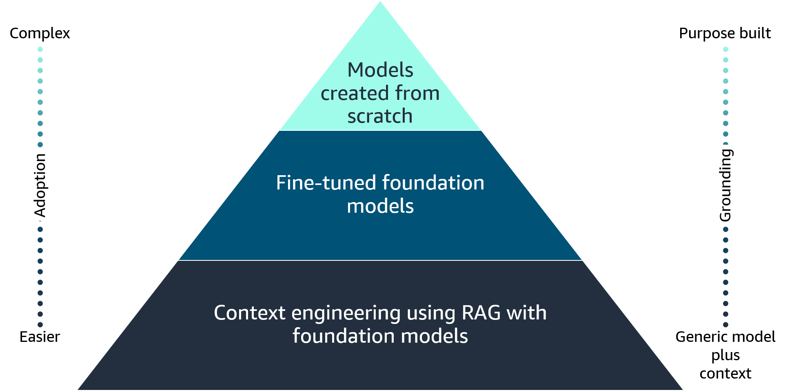

# Improving the Performance of an FM
After selecting an appropriate pre-trained foundation model that aligns with the business use case, the next step is to focus on improving the performance of the model. This can be achieved through various techniques such as prompt engineering, RAG, fine-tuning, or automation agents.

## Prompt engineering
Prompt engineering is the fastest way to harness the power of large language models (LLMs). By interacting with an LLM through prompts (a series of questions, statements, or instructions), you can adjust LLM output behavior based on the specific context of the output that you want to achieve.

Prompt engineering refers to the process of carefully crafting the input prompts or instructions given to the model to generate desired outputs or behaviors. The phrasing, structure, and content of the prompt can significantly influence the quality, relevance, and characteristics of the generated outputs. Prompt engineering aims to optimize the prompts to steer the model's generation in the desired direction, using the model's capabilities while mitigating potential biases or undesirable outputs.

Some key aspects of prompt engineering include the following:

* *Design:* Crafting clear, unambiguous, and context-rich prompts that effectively communicate the desired task or output to the model
* *Augmentation:* Incorporating additional information or constraints into the prompts, such as examples, demonstrations, or task-specific instructions, to guide the model's generation process
* *Tuning:* Iteratively refining and adjusting the prompts based on the model's outputs and performance, often through human evaluation or automated metrics
* *Ensembling:* Combining multiple prompts or generation strategies to improve the overall quality and robustness of the outputs
* *Mining:* Exploring and identifying effective prompts through techniques like prompt searching, prompt generation, or prompt retrieval from large prompt libraries

Prompt engineering is particularly important for generative AI models. These models are trained on vast amounts of data and can exhibit undesirable behaviors or generate outputs that are inconsistent with the intended task or context. By carefully engineering the prompts, developers can better control and steer the model's generation process, improving the quality, safety, and reliability of the outputs.

## Prompt techniques
Prompt engineering techniques are strategies used to guide generative AI models. Some common prompt engineering techniques include the following:

* Zero-shot prompting
* Few-shot prompting
* Chain-of-thought (CoT) prompting
* Self-consistency
* Tree of thoughts (ToT)
* Retrieval Augmented Generation (RAG)
* Automatic Reasoning and Tool-use (ART)
* ReAct prompting

For the purpose of this course, let's focus on Retrieval Augmented Generation (RAG).

## RAG
RAG is a natural language processing (NLP) technique that combines the capabilities of retrieval systems and generative language models to produce high-quality and informative text outputs.

RAG incorporates two main components. To learn more, see each of the following.

* **A retrieval system**
This component retrieves relevant information from a large corpus of text data, such as a knowledge base, web pages, or other textual sources. The retrieval system uses techniques like information retrieval, sparse indexing, or dense retrieval to identify the most relevant passages or documents for a given input query or context.

* **A generative language model**
This component is a large pre-trained language model, such as GPT-3, BART, or T5, that can generate natural language text. The language model takes the input query or context, along with the retrieved relevant information. And from this, it generates a coherent and fluent text output that combines the retrieved knowledge with its own understanding and language generation capabilities.

The RAG prompt techniques approach uses retrieval systems and generative language models. The retrieval system provides access to a vast amount of factual knowledge and information. And the generative language model can synthesize and present this information in a natural and coherent manner, tailored to the specific input or context.

#### RAG business applications
RAG has several business applications, including the following:

* Building intelligent question-answering systems 
* Expanding and enriching existing knowledge bases 
* Generating high-quality content

* **Building intelligent question-answering systems**
RAG can be used to build intelligent question-answering systems that can retrieve relevant information from large knowledge bases and generate natural language responses. This can be useful in customer support, virtual assistants, or any domain where users need quick and accurate information.

* **Expanding and enriching existing knowledge bases**
RAG can also expand and enrich existing knowledge bases by generating new knowledge or rephrasing existing information in a more natural and understandable way. This can improve the accessibility and usability of knowledge bases for various applications.

* **Generating high-quality content**
RAG also generates high-quality content, such as articles, reports, or summaries, by combining retrieved information from various sources with the language generation capabilities of the model. This can be useful in domains like journalism, research, or content marketing.

#### Amazon Bedrock knowledge base examples
Knowledge bases for Amazon Bedrock provide you the capability of amassing data sources into a repository of information. RAG can use knowledge bases across various domains to provide intelligent and contextual responses, recommendations, or analysis by combining information retrieval and natural language generation capabilities. Here are some examples of Amazon Bedrock knowledge bases that could be applicable to Retrieval Augmented Generation (RAG) business use cases:

* **Customer Service Chatbot**
*Knowledge base:* A comprehensive product knowledge base containing information about products, features, specifications, troubleshooting guides, and FAQs

*RAG application:* A customer service chatbot that can answer customer queries by retrieving relevant information from the product knowledge base and generating natural language responses

* **Legal Research And Analysis**
*Knowledge base:* A vast legal knowledge base containing laws, regulations, case precedents, legal opinions, and expert analysis

*RAG application:* A legal research assistant that can provide relevant information and analysis for specific legal queries by retrieving information from the legal knowledge base and generating summaries or insights

* **HealthCare Question-Answering**
*Knowledge base:* A medical knowledge base containing information about diseases, treatments, clinical guidelines, research papers, and patient education materials

*RAG application:* A virtual healthcare assistant that can answer complex medical queries by retrieving relevant information from the knowledge base and generating concise and accurate responses

Overall, RAG is a powerful technique that combines the strengths of retrieval systems and generative language models. It facilitates the creation of intelligent systems that can retrieve relevant information and present it in a natural and coherent manner. This makes it a valuable tool for various business applications involving knowledge management, content generation, and intelligent assistants.

## Fine-tuning

Fine-tuning is another way to improve the performance of a foundation model even further. Fine-tuning refers to the process of taking a pre-trained language model and further training it on a specific task or domain-specific dataset. Fine-tuning allows the model to adapt its knowledge and capabilities to better suit the requirements of the business use case. Although FMs are pre-trained through self-supervised learning and have inherent capability of understanding information, fine-tuning the FM base model can improve performance.

There are two ways to fine-tune a model:

1. Instruction fine-tuning uses examples of how the model should respond to a specific instruction. Prompt tuning is a type of instruction fine-tuning.

2. Reinforcement learning from human feedback (RLHF) provides human feedback data, resulting in a model that is better aligned with human preferences.

Let's consider a use case for fine-tuning. If you are working on a task that requires industry knowledge, you can take a pre-trained model and fine-tune the model with industry data. If the task involves medical research, for example, the pre-trained model can be fine-tuned with articles from medical journals to achieve more contextualized results. To learn more about fine-tuning, See the display of each of the seven steps below.

#### How fine-tuning works

* **Step1: Start with a pre-trained language model.**
Large language models are trained on vast amounts of general-purpose text data. This helps them to develop a broad understanding of language and acquire general knowledge.

* **Step2: Prepare a task-specific dataset.**
Collect a dataset that is relevant to the task or domain that you want the model to specialize in. This dataset should contain examples of inputs and desired outputs for the specific task.

* **Step3: Add task-specific layers.**
The pre-trained model's architecture is often modified by adding additional layers or components specific to the target task. For example, a classification layer might be added for text classification tasks or a decoder component for text generation tasks.

* **Step4: Fine-tune the model.**
The pre-trained model, with the added task-specific layers, is then fine-tuned on the task-specific dataset. During fine-tuning, the model's parameters are updated to better capture the patterns and nuances present in the task-specific data.

* **Step5: Evaluate and iterate.**
After fine-tuning, the model's performance is evaluated on a test set for the target task. If the performance is not satisfactory, the fine-tuning process can be repeated with different hyperparameters, more data, or different task-specific architectures.

**Summary**
Fine-tuning lets the generative AI model use its pre-trained knowledge while adapting to the specific requirements of the target task or domain. This approach is particularly useful when the target task has a limited amount of training data. This is because the pre-trained model can provide a strong foundation of general knowledge, which is then specialized during fine-tuning.

## Creating a foundation model from scratch
In the context of the generative AI application lifecycle, creating a model from scratch involves training a completely new model architecture on a custom dataset, without using any pre-existing models or weights. This approach is typically undertaken when there are no suitable pre-trained models available for the specific task or domain, or when the requirements for accuracy, performance, or customization are exceptionally high.

The process of creating a model from scratch begins with defining the model architecture, which involves selecting the appropriate neural network architecture, layers, and hyperparameters based on the problem at hand. This step requires a deep understanding of machine learning concepts and techniques, as well as domain expertise to ensure that the model is designed to capture the relevant patterns and features in the data.

Next, a large and diverse dataset must be curated, cleaned, and preprocessed to serve as the training data for the model. This dataset should be representative of the real-world data that the model will encounter and should cover a wide range of scenarios and variations.

After the dataset is prepared, the model is initialized with random weights and trained using various optimization algorithms in an iterative process. During training, the model's weights are adjusted based on the input data and the corresponding target outputs, with the goal of minimizing the loss function and improving the model's performance on the training data.

Creating a model from scratch allows for complete customization and tailoring to the specific problem. But it comes at a significant cost in terms of computational resources, time, and expertise required. It is often a more suitable approach for research or highly specialized applications where existing pre-trained models are inadequate or unavailable.

## Cost trade-offs of various approaches to foundation model customization
When developing a generative AI application, there is often a trade-off between cost and accuracy when deciding whether to use a pre-trained foundation model or pursue a more customized approach.

Pre-trained models, such as large language models or computer vision models, offer a cost-effective solution. They have already undergone extensive training on vast amounts of data, so they require less computational resources and time for fine-tuning or transfer learning. However, these pre-trained models might not always achieve the desired level of accuracy or performance for specific tasks or domains.

Pursuing a more customized approach, such as training a model from scratch or heavily fine-tuning a pre-trained model, can potentially yield higher accuracy and better performance tailored to the specific use case. However, this customization comes at a higher cost in terms of computational resources, data acquisition, and specialized expertise required for training and optimization.

When deciding on the appropriate customization technique for their generative AI application, organizations must carefully evaluate the cost-accuracy trade-off. They must balance their budget constraints, performance requirements, and the availability of high-quality domain-specific data.

## Automated multi-step tasks with agents
Agents are another component in generative AI solutions that can enhance the performance and capabilities of the foundation model. As generative AI models become more advanced and capable, there is a growing need for agents and automation to streamline and optimize the various phases of the application lifecycle. Agents play a crucial role in breaking down complex processes into smaller, manageable steps and orchestrating their completion. Agents are software components or entities designed to perform specific actions or tasks autonomously or semi-autonomously, based on predefined rules or algorithms.

In the case of Amazon Bedrock, agents are used to manage and carry out various multi-step tasks  related to infrastructure provisioning, application deployment, and operational activities.

Here are some examples of tasks that agents can accomplish:

* *Task coordination:* Agents coordinate the completion of subtasks in the correct order, and ensure that dependencies and prerequisites are met before proceeding to the next step. They manage the flow of information and data between different subtasks and ensure that the overall task progresses smoothly.

* *Reporting and logging:* Agents can provide detailed logs and reports on the progress and status of multi-step tasks, including metrics, performance data, and diagnostic information. This aids in troubleshooting, auditing, and analyzing the overall process.

* *Scalability and concurrency:* Agents can be designed to handle multiple instances of multi-step tasks concurrently. This permits parallel implementation and improves overall throughput and scalability.

* *Integration and communication:* Agents often must integrate with other systems, services, or components to exchange data, initiate actions, or receive notifications. They might communicate through APIs, message queues, or other communication channels.

In the case of Amazon Bedrock, agents might be responsible for tasks such as provisioning and configuring cloud resources (for example, EC2 instances, load balancers, or databases). They can also deploy applications or services across multiple environments, automate operational tasks like backups or scaling, and monitor the overall health and performance of the infrastructure.

By using agents for multi-step tasks, organizations can achieve higher levels of automation, consistency, and efficiency in their cloud operations, while also improving visibility, control, and auditability of the processes involved.
