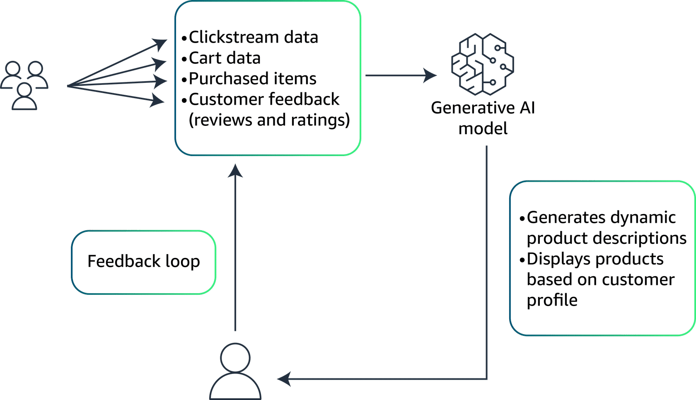
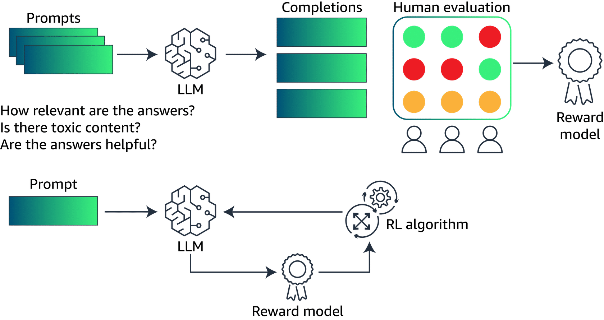
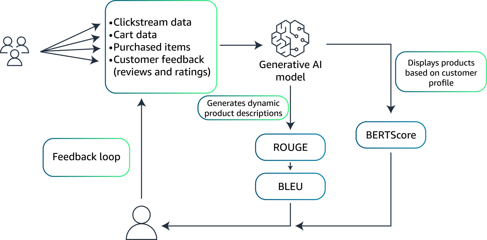

# Business case

## AnyCompany: A fashion retailer

AnyCompany, a trendy online fashion retailer, faces challenges with high cart abandonment rates and low repeat purchases. Customers often feel overwhelmed by the vast options and find it difficult to determine which products suit their personal style and needs. 

AnyCompany  aims to personalize the shopping experience more effectively, increasing user engagement, reducing cart abandonment, and boosting repeat purchases.

AnyCompany is willing to use the power of generative AI to achieve these goals. Specifically, they will monitor the following metrics:

* *Conversion rate:* Increase in successful purchases for each site visit
* *Average order value:* Increase in the dollar amount spent for each transaction
* *Customer retention rate:* Increase in the percentage of returning customers

## The solution

AnyCompany will use an LLM that will have several functions. It will generate dynamic product descriptions, offer personalized shopping advice, and improve automated interactions. The solution will include the following:

* *Utilization of specific datasets:* Fine-tuning on transactional data, customer feedback, and user interaction data (likes, clicks, past purchases).

* *Integration with recommendation engine:* The AI model will adapt product displays and promotions to fit individual customer profiles in real time.

* *Continuous learning:* Adjust the model periodically, based on new customer data and evolving fashion trends, optimizing recommendation accuracy without manual intervention.

**Data ingestion**
This step captures detailed user interaction, data, and customer feedback. This will help understand how users engage with existing product descriptions and their responses or comments about product features. User feedback is also analyzed to identify language or trends that resonate with customer preferences.

**Model outputs**
The generative AI model generates dynamic product descriptions that are based on customer preferences, habits, and more.

The products displayed for a given customer will be also dynamically modified.

**Feedback loop**
A feedback loop uses customer feedback and interactions to further refine the model's performance.

# Fine-Tuning

## Introduction
Although foundation models are highly versatile, they often require fine-tuning to tailor their broad capabilities to specific applications or to enhance their performance in particular domains. Fine-tuning is critical because it helps to do the following:

* *Increase specificity:* Adapt the model’s responses or predictions to the nuances of a specific domain or task that were not adequately covered in the initial training.

* *Improve accuracy:* Enhance the model's performance on specialized tasks by training on domain-specific data, thereby reducing errors that occur due to the generic nature of foundational training.

* *Reduce biases:* Address and mitigate any biases inherent in the initial training data, making the model more fair and appropriate for different applications.

* *Boost efficiency:* Streamline the model’s operations within specific contexts, potentially reducing computational requirements and speeding up response times.

In the next section, you will look further into the different ways to fine-tune a foundation model.

## The different fine-tuning approaches
* **Instruction tuning:** This approach involves retraining the model on a new dataset that consists of prompts followed by the desired outputs. This is structured in a way that the model learns to follow specific instructions better. This method is particularly useful for improving the model's ability to understand and execute user commands accurately, making it highly effective for interactive applications like virtual assistants and chatbots. 

* **Reinforcement learning from human feedback (RLHF):** This approach is a fine-tuning technique where the model is initially trained using supervised learning to predict human-like responses. Then, it is further refined through a reinforcement learning process, where a reward model built from human feedback guides the model toward generating more preferable outputs. This method is effective in aligning the model’s outputs with human values and preferences, thereby increasing its practical utility in sensitive applications.

RLHF refers to the improvement of the model by learning from feedback, such as ratings, preferences, demonstrations, helpfulness, or toxicity, provided by humans. RLHF is used during the pretraining phase of the model but can also be used to fine-tune the model.

* **Adapting models for specific domains:** This approach involves fine-tuning the model on a corpus of text or data that is specific to a particular industry or sector.  An example of this would be legal documents for a legal AI or medical records for a healthcare AI. This specificity enables the model to perform with a higher degree of relevance and accuracy in domain-specific tasks, providing more useful and context-aware responses.

* **Transfer learning:** This approach is a method where a model developed for one task is reused as the starting point for a model on a second task. For foundational models, this often means taking a model that has been trained on a vast, general dataset, then fine-tuning it on a smaller, specific dataset. This method is highly efficient in using learned features and knowledge from the general training phase and applying them to a narrower scope with less additional training required.

* **Continuous pretraining:** This approach involves extending the training phase of a pre-trained model by continuously feeding it new and emerging data. This approach is used to keep the model updated with the latest information, vocabulary, trends, or research findings, ensuring its outputs remain relevant and accurate over time.

## Preparing the data for the fine-tuning step
During the initial training phase, a foundational model is trained on a vast and diverse dataset. This dataset typically encompasses a wide range of topics to develop a broad understanding and general capabilities. The goals during this phase are as follows:

* *Extensive coverage:* Ensuring the dataset covers a broad spectrum of knowledge to give the model a robust foundational understanding

* *Diversity:* Including varied types of data from numerous sources to equip the model with the ability to handle a wide array of tasks

* *Generalization:* Focusing on building a model that can generalize across different tasks and domains without specific tailoring
Data preparation for this phase involves collecting as much data as possible. The data is often from publicly available sources, curated datasets, and sometimes proprietary data, depending on the model's intended usage. The data needs thorough cleaning and possibly anonymization to ensure privacy and compliance with regulations.

**Data preparation for fine-tuning**
Fine-tuning, on the other hand, is a more targeted process where a pretrained model is adapted to perform well on a specific task or within a particular domain. The data preparation for fine-tuning is distinct from initial training due to the following reasons:

* *Specificity:* The dataset for fine-tuning is much more focused, containing examples that are directly relevant to the specific tasks or problems the model needs to solve.

* *High relevance:* Data must be highly relevant to the desired outputs. Examples include legal documents for a legal AI or customer service interactions for a customer support AI.

* *Quality over quantity:* Although the initial training requires massive amounts of data, fine-tuning can often achieve significant improvements with much smaller, but well-curated datasets.

**Key steps in fine-tuning data preparation**

The following list walks through the key steps in fine-tuning data preparation:

1. *Data curation:* Although it is a continuation, this involves a more rigorous selection process to ensure every piece of data is highly relevant. This step also ensures the data contributes to the model's learning in the specific context.

2. *Labeling:* In fine-tuning, the accuracy and relevance of labels are paramount. They guide the model's adjustments to specialize in the target domain.

3. *Governance and compliance:* Considering fine-tuning often uses more specialized data, ensuring data governance and compliance with industry-specific regulations is critical.

4. *Representativeness and bias checking:* It is essential to ensure that the fine-tuning dataset does not introduce or perpetuate biases that could skew the model's performance in undesirable ways.

5. *Feedback integration:* For methods like RLHF, incorporating user or expert feedback directly into the training process is crucial. This is more nuanced and interactive than the initial training phase.

# Model evaluation

## Introduction
When evaluating the performance of language models, especially those involved in generating or transforming text, specific metrics can be used. These metrics are made to assess the quality of the output, compared to a human-written standard. Three commonly used metrics for this purpose are Recall-Oriented Understudy for Gisting Evaluation (ROUGE), Bilingual Evaluation Understudy (BLEU), and BERTScore.

## ROUGE

ROUGE is a set of metrics used to evaluate automatic summarization of texts, in addition to machine translation quality in NLP. The main idea behind ROUGE is to count the number of overlapping units. This includes words, N-grams, or sentence fragments between the computer-generated output and a set of reference (human-created) texts.

The following are two ways to use the ROUGE metric:

* *ROUGE-N:* This metric measures the overlap of n-grams between the generated text and the reference text. For example, ROUGE-1 refers to the overlap of unigrams, ROUGE-2 refers to bigrams, and so on. This metric primarily assesses the fluency of the text and the extent to which it includes key ideas from the reference.

* *ROUGE-L:* This metric uses the longest common subsequence between the generated text and the reference texts. It is particularly good at evaluating the coherence and order of the narrative in the outputs.

ROUGE is widely used because it is not complex. It is interpretable, and correlates reasonably well with human judgment, especially when evaluating the recall aspect of summaries. The evaluations assess how much of the important information in the source texts is captured by the generated summaries.

## BLEU

BLEU is a metric used to evaluate the quality of text that has been machine-translated from one natural language to another. Quality is calculated by comparing the machine-generated text to one or more high-quality human translations. BLEU measures the precision of N-grams in the machine-generated text that appears in the reference texts and applies a penalty for overly short translations (brevity penalty).

Unlike ROUGE, which focuses on recall, BLEU is fundamentally a precision metric. It checks how many words or phrases in the machine translation appear in the reference translations. BLEU evaluates the quality at the level of the sentence, typically using a combination of unigrams, bigrams, trigrams, and quadrigrams. A brevity penalty discourages overly concise translations that might influence the precision score.

BLEU is popular in the field of machine translation for its ease of use and effectiveness at a broad scale. However, it has limitations in assessing the fluency and grammaticality of the output.

## The BERTScore

BERTScore uses the pretrained contextual embeddings from models like BERT to evaluate the quality of text-generation tasks. BERTScore computes the cosine similarity between the contextual embeddings of words in the candidate and the reference texts. This is unlike traditional metrics that rely on exact matches of N-grams or words.

Because BERTScore evaluates the semantic similarity rather than relying on exact lexical matches, it is capable of capturing meaning in a more nuanced manner. BERTScore is less prone to some of the pitfalls of BLEU and ROUGE. An example of this is their sensitivity to minor paraphrasing or synonym usage that does not affect the overall meaning conveyed by the text.

BERTScore is increasingly used alongside traditional metrics like BLEU and ROUGE for a more comprehensive assessment of language generation models. This is especially true in cases where capturing the deeper semantic meaning of the text is important.

## AnyCompany model evaluation
To learn more about how AnyCompany could use these metrics to evaluate the performance of its model, choose each hotspot.

**ROUGE**
For dynamic product descriptions, ROUGE can be used to ensure completeness of the information. (Reminder: ROUGE measures the overlap of N-grams between the generated product description and a reference product description).

**BLEU**
Bleu can be used in combination with ROUGE to also ensure the accurate inclusion of critical product features and key phrases that might influence purchase decisions.

**BERTScore**
For the displayed products, in contrast, the BERTscore can be used. This will assess the semantic appropriateness and personalization of the product recommendation.

In addressing AnyCompany's challenges of high cart abandonment and low repeat purchases, the integration of an FM using generative AI has demonstrated substantial improvements in key business metrics. Post-implementation, the conversion rate increased by 15 percent, thanks to more engaging product descriptions. This enhancement was quantitatively supported by ROUGE scores averaging 0.85. This indicates a high overlap of generated content with reference material, ensuring completeness and relevance that directly encouraged purchases. The average order value saw a 20 percent uplift. This is influenced by the precision and accuracy of technical terms and persuasive language in product descriptions, validated by a BLEU scores of 0.78. These scores are considered good in this context, because they suggest a strong correspondence with the quality of language that historically leads to higher sales.

Additionally, the customer retention rate improved by 25 percent, supported by BERTScore evaluations averaging 0.90. This high score reflects excellent semantic quality of the personalized shopping advice and product displays. This indicates the content is not only accurate, but deeply relevant to individual preferences, thus enhancing customer satisfaction and loyalty.

These metrics, by confirming the high quality and relevance of the AI-generated content, have played a paramount role in achieving AnyCompany’s goals. These goals included enhancing user engagement, reducing cart abandonment, and boosting repeat purchases through improved personalization and content accuracy.
