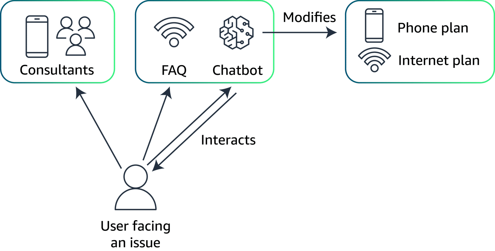
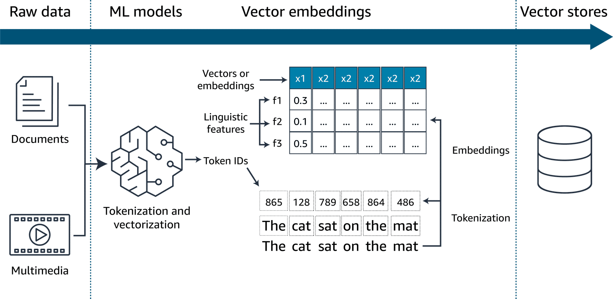
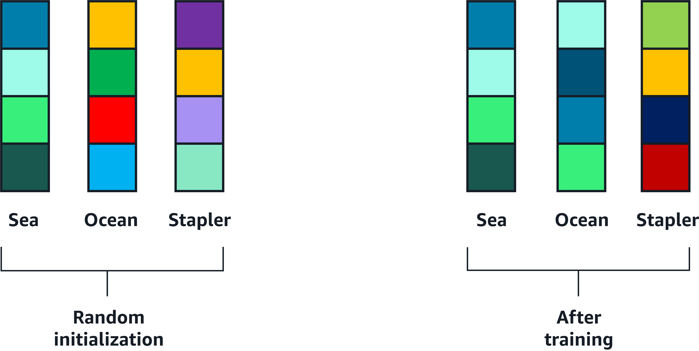
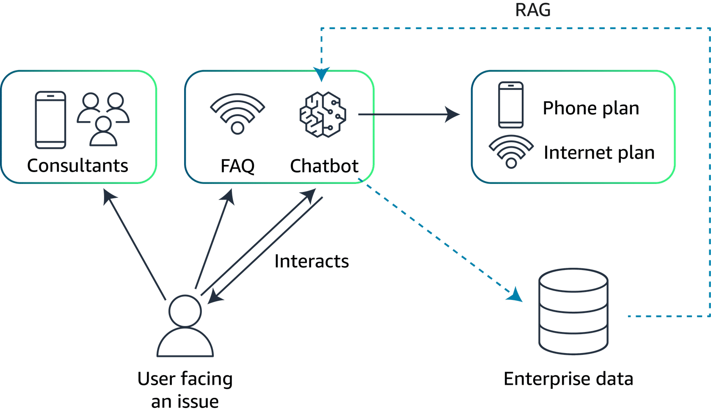
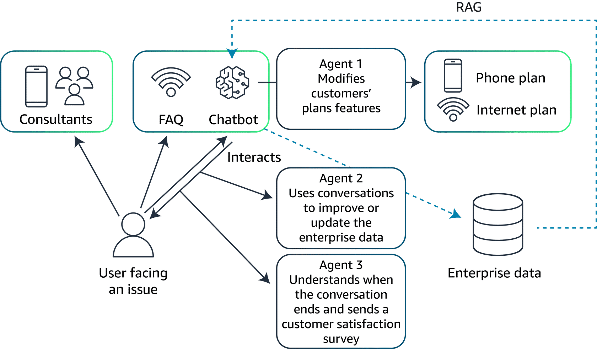
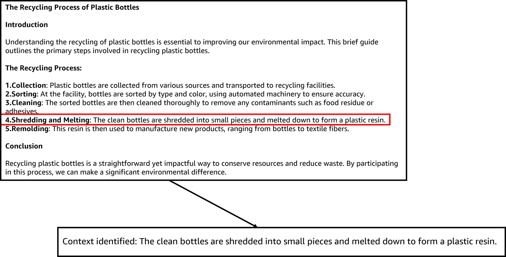
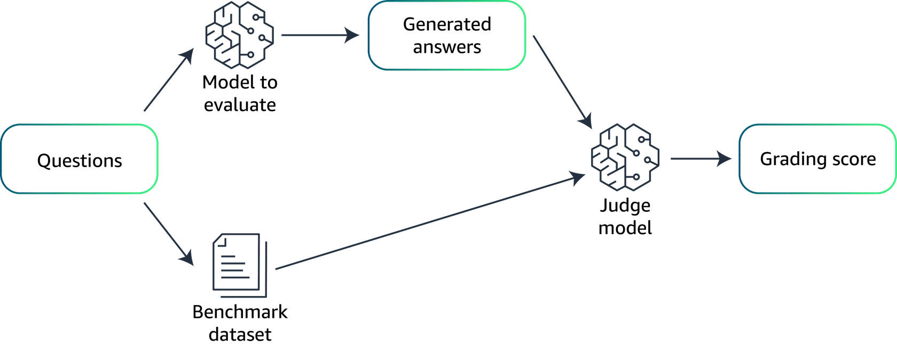
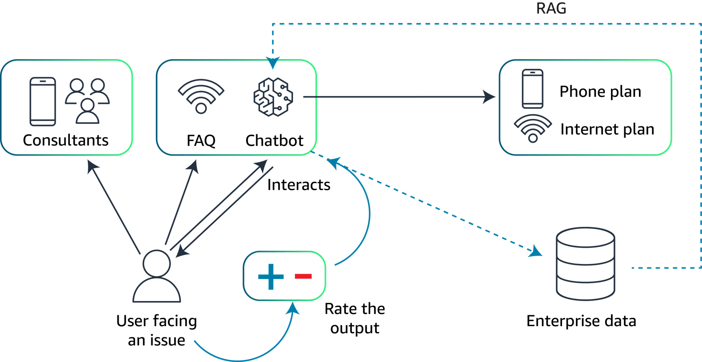

# Business case

## Introduction: AnyCompany, a telecom company
AnyCompany is a telecommunications provider offering phone and internet services. 

Typically, customers experiencing issues contact AnyCompany's support center by phone, a process that is both costly and inefficient.

To streamline support, AnyCompany is shifting toward online solutions, initially creating an FAQ section on their website to address common problems. Despite this, the volume of online support tickets remains high. To further reduce the workload on their staff and enhance customer service efficiency, AnyCompany is exploring the potential of generative artificial intelligence (AI) to develop a chatbot. The chatbot would be capable of guiding customers, answering common issues, and performing certain tasks autonomously such as ordering a new phone, upgrading the phone plan to get more 5G data, and so on.

AnyCompany has a target of decreasing the number of online tickets by 70 percent  after putting the chatbot into production. The company will also monitor the customer satisfaction score by providing a survey to their customers after solving their issues. With the addition of the chatbot, the company wishes to reach a satisfaction score of at least 4 out of 5.

Architecture diagram of the AnyCompany support system.

## Look further into the solution

To build the chatbot, AnyCompany needs to choose a foundation model (FM). The model will need capabilities in natural language processing (NLP) and understanding, in addition to an integration with AnyCompany's backend system for automation.

AnyCompany needs to choose a large language model (LLM) because these FMs have the ability to understand and process natural language. LLMs are trained over a large amount of public data, which is great for general language understanding. However, this is not optimal to answer specific customer requests about AnyCompany's services. Therefore, AnyCompany needs a way to incorporate data and a knowledge base coming from AnyCompany to improve the accuracy of the chatbot's answers by providing it with more context. 

This additional data might come from chat logs, previously handled support tickets, or even support call recordings. The data needs to be collected, anonymized, and cleansed to be incorporated in a knowledge base that can, in turn, be used by the chatbot.  

Finally, because AnyCompany is willing to have the chatbot handle some tasks autonomously, the chatbot needs to be able to launch additional functions that can modify parameters in customers' accounts.

# Retrieval-Augmented Generation

## Introduction
In the previous lesson, the business case of AnyCompany illustrated how FMs are not enough to provide qualified outputs on their own. In this lesson, you will learn the Retrieval-Augmented Generation (RAG) approach that allows FMs to query knowledge bases to provide accurate and up-to-date answers to customer prompts.

## From dataset to vector embeddings
**Enterprise datasets**

Although LLMs can generate human-like text, image, audio, and more from prompts, this capability might not meet the specific needs of enterprises. Customized enterprise applications require these models to process relevant data from enterprise datasets.

Enterprises gather vast amounts of internal data, including documents, presentations, user manuals, reports, and transaction summaries, all unfamiliar to the FM. When these models ingest and use enterprise data sources, they acquire domain-specific knowledge, enabling them to produce tailored, highly relevant outputs that meet enterprise needs.

To provide the relevant enterprise data as additional context to the language model, along with the prompt, this addition helps the model deliver more accurate outputs. Determining the right context involves searching enterprise datasets using the prompt text. Vector embeddings play a crucial role in this process.

## Vector embeddings
Embedding is the process by which text, images, and audio are given numerical representation in a vector space. Embedding is usually performed by a machine learning (ML) model. The following diagram provides more details about embedding.

Enterprise datasets, such as documents, images and audio, are passed to ML models as tokens and are vectorized. These vectors in an n-dimensional space, along with the metadata about them, are stored in purpose-built vector databases for faster retrieval.

You will now take a closer look at the embedding step.

Two words that relate to each other will have similar embeddings.

Here is an example of two words: sea and ocean. They are randomly initialized and their early embeddings are diverse. As the training progresses, their embeddings become more similar because they often appear close to each other and in similar context. For the purpose of this example, embeddings that are close together are represented by colors in the same palette. Therefore, the word sea and ocean use similar colors. However, stapler has a completely different embedding, so it uses a separate set of colors.

Words that relate to each other will have closer embeddings.

## Storing vectors
The core function of vector databases is to compactly store billions of high-dimensional vectors representing words and entities. Vector databases provide ultra-fast similarity searches across these billions of vectors in real time. 

The most common algorithms used to perform the similarity search are k-nearest neighbors (k-NN) or cosine similarity.

Amazon Web Services (AWS) offers the following viable vector database options:

* Amazon OpenSearch Service (provisioned)
* Amazon OpenSearch Serverless
* pgvector extension in Amazon Relational Database Service (Amazon RDS) for PostgreSQL
* pgvector extension in Amazon Aurora PostgreSQL-Compatible Edition
* Amazon Kendra

## RAG in the context of AnyCompany's business case
Following is an updated version of AnyCompany's architecture diagram, including the RAG system. The chatbot is now able to query a database containing enterprise data and use it to provide more accurate and contextual answers to users.

Architecture diagram of AnyCompany's system, including a RAG approach for optimizing the model's performances.

# Agents

## Introduction
In this lesson, using the AnyCompany business case as an example, we illustrate the use of agents to meet business requirements.

## Key functions of agents
Agents can serve different roles in a generative AI application, such as the following:

* **Intermediary operations:** Agents can act as intermediaries, facilitating communication between the generative AI model and various backend systems. The generative AI model handles language understanding and response generation. The various backend systems include items such as databases, CRM platforms, or service management tools.

* **Actions launch:** Agents can be used to run a wide variety of tasks. These tasks might include adjusting service settings, processing transactions, retrieving documents, and more. These actions are based on the users' specific needs understood by the generative AI model.

* **Feedback integration:** Agents can also contribute to the AI system's learning process by collecting data on the outcomes of their actions. This feedback helps refine the AI model, enhancing its accuracy and effectiveness in future interactions.

## AnyCompany: The use of agents
AnyCompany is a telecom company using the power of generative AI to reduce the amount of tickets to be handled by their employees. To automatize the maximum number of tasks, AnyCompany need to combine agents with their generative AI model.

Following is a more detailed view of AnyCompany's architecture using agents. In this diagram, Agent 1 is used to take actions on customers' plans, based on their prompts. Agent 2 uses the conversation between the user and the chatbot to update or add more data to the enterprise data database. In turn, that refined data can be used in the RAG system to provide more appropriate answers later. Agent 3 is used to send a satisfaction survey to the user when the conversation ends. This will help AnyCompany monitor the satisfaction score and ensure that they meet their goal to improve this satisfaction score.

AnyCompany's architecture diagram including three agents.

# Evaluate results

## Introduction
Evaluating the performance of generative AI models is critical for understanding their effectiveness and ensuring they meet intended objectives. Two of the most common evaluation methods are human evaluation and the use of benchmark datasets. Each method provides unique insights and is suitable for different aspects of model performance assessment.

## Human evaluation
Human evaluation involves real users interacting with the AI model to provide feedback based on their experience. This method is particularly valuable for assessing qualitative aspects of the model, such as the following:

* **User experience:** How intuitive and satisfying is the interaction with the model from the user's perspective?

* **Contextual appropriateness:** Does the model respond in a way that is contextually relevant and sensitive to the nuances of human communication?

* **Creativity and flexibility:** How well does the model handle unexpected queries or complex scenarios that require a nuanced understanding?

Human evaluation is often used for iterative improvements and tuning the model to better meet user expectations.

## Benchmark datasets
Benchmark datasets, on the other hand, provide a quantitative way to evaluate generative AI models. These datasets consist of predefined datasets and associated metrics that offer a consistent, objective means to measure model performances. This might include the following:

* **Accuracy:** How accurately does the model perform specific tasks according to predefined standards?

* **Speed and efficiency:** How quickly does the mode generate responses and how does this impact operational efficiency?

* **Scalability:** Can the mode maintain its performance as the scale of data or number of users increases?

Benchmark datasets are particularly useful for initial testing phases to ensure that the model meets certain technical specifications before it is put through more subjective human evaluations. They are also essential for comparing performance across different models or different iterations of the same model.

To learn more about how to create a benchmark dataset, see the following three steps below.

#### Creating a benchmark dataset
The creation of a benchmark dataset is key to evaluate a RAG system. Following are the steps involving the creation of a benchmark dataset.

**Step1: Create relevant questions**
First, subject matter experts (SMEs) create relevant and challenging questions related to the topic of interest or specific documents.

**Step2: Context identification**

SMEs identify pertinent sections of the documents that provide context necessary for generating answers.

**Step3: Answer drafting**

SMEs draft precise answers, which become the benchmark for evaluating the RAG system's responses.

**Summary**
Creating a benchmark dataset is a manual process that is necessary to properly evaluate LLM performances using RAG systems.

The evaluation of LLM performance using a benchmark dataset can be automated using an LLM as a judge approach.

To learn more about the LLM as a judge approach, see each of the following below.

1. **Questions**
A list of questions is used to create a benchmark dataset. The same list of questions is then provided to the model for performance evaluation.

2. **Benchmark dataset**
The benchmark dataset contains both the answers and context provided by the SMEs.

3. **Generated answers**
Based on the question list, the model generates answers.

4. **The judge model**
The judge model is an external model that is used to compare the answers from the SMEs available in the benchmark dataset against the answers generated by the model to evaluate.

5. **Grading score**
The judge model calculates a grading score to assess the performance of the model. This score should take in to account metrics such as accuracy (correctness of the response), relevance (suitability of the response to the question), and comprehensiveness (depth and breadth of the response).

## Combined approach
In practice, a combination of both human evaluation and benchmark datasets is often used to provide a comprehensive overview of a model's performance. Although benchmark datasets can quantify the model's technical capabilities, human evaluation brings an essential human-centric perspective that benchmarks cannot capture alone. This combined approach ensures that the model is not only technically proficient but also effective and engaging in real-world scenarios.

## AnyCompany business case
Review AnyCompany's business case. Before deploying the chatbot model into production, the company can evaluate the model's performances against benchmark datasets. After the model is in production, a real human will interact with the model and can rate their interaction. This helps the model to improve its accuracy as a function of time.

AnyCompany architecture diagram with a human rating the interaction with the model.
