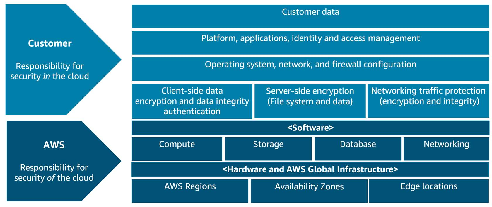
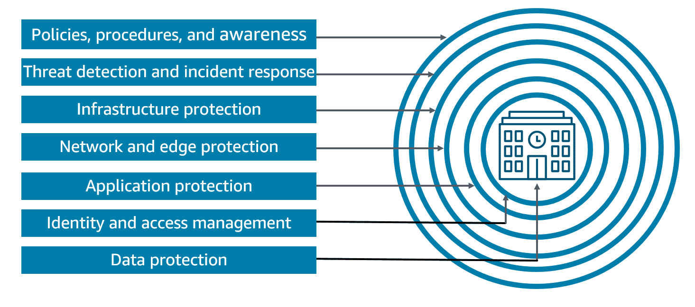
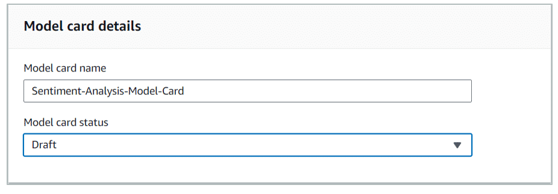

# Security and Privacy Considerations for AI Systems

## Security considerations

In the context of AI and generative AI, there are a number of security tasks, such as threat detection, vulnerability management, infrastructure protection, prompt injection, and data encryption. Following is a description of each of these tasks.

**Threat detection**
To detect threats to your AI systems, do the following:

* Identify and monitor for potential security threats, such as malicious actors attempting to exploit vulnerabilities in AI systems or using generative AI for malicious purposes. The following are some examples:
 - Generating fake content
 - Manipulating data
 - Automating attacks

* You can assist threat detection by developing and deploying AI-powered threat detection systems. You can analyze network traffic, user behavior, and other data sources to detect and respond to potential threats.

For more information, see [Threat Detection](https://docs.aws.amazon.com/whitepapers/latest/aws-caf-for-ai/security-perspective-compliance-and-assurance-of-aiml-systems.html#threat-detection) and [Protect Against Adversarial and Malicious Activities](https://docs.aws.amazon.com/wellarchitected/latest/machine-learning-lens/mlsec-11.html).

**Vulnerability management**
To help manage vulnerability, do the following:

* Identify and address vulnerabilities in AI and generative AI systems, including software bugs, model weaknesses, and potential attack vectors (for example, malware, viruses, and email attachments).

* Regularly conduct security assessments, penetration testing (attempt to find and exploit vulnerabilities), and code reviews to uncover and address vulnerabilities.

* Implement robust patch management and update processes to ensure that AI systems are kept up to date and secure.

For more information, see [Vulnerability Management](https://docs.aws.amazon.com/whitepapers/latest/aws-caf-for-ai/security-perspective-compliance-and-assurance-of-aiml-systems.html#vulnerability-management).

**Infrastructure protection**
To ensure that your infrastructure is protected, do the following:

* Secure the underlying infrastructure that supports AI and generative AI systems, such as the following:
 - Cloud computing platforms
 - Edge devices
 - Data stores

* Implement strong access controls, network segmentation, encryption, and other security measures to protect the infrastructure from unauthorized access and attacks.

* Ensure that the AI infrastructure is resilient and can withstand failures, attacks, or other disruptions.

For more information, see [Infrastructure Protection](https://docs.aws.amazon.com/whitepapers/latest/aws-caf-for-ai/security-perspective-compliance-and-assurance-of-aiml-systems.html#infrastructure-protection).

**Prompt injection**
You need to mitigate the risk of prompt injection attacks. In these attacks, adversaries attempt to manipulate the input prompts of generative AI models to generate malicious or undesirable content. To reduce the risk, do the following:

* Employ techniques, such as prompt filtering, sanitization, and validation, to ensure that the input prompts are safe and do not contain malicious content.

* Develop robust models and training procedures that are resistant to prompt injection attacks.

For more information, see [Protect Against Data Poisoning Threats](https://docs.aws.amazon.com/wellarchitected/latest/machine-learning-lens/mlsec-10.html).

**Data encryption**
To protect the confidentiality and integrity of the data used to train and deploy AI and generative AI models, do the following:

* Implement strong encryption mechanisms to secure both data at rest and data in transit. Data at rest refers to data that is stored on servers, in databases, or on local devices. Data in transit refers to data that is transmitted during communication between different components of the AI system.

* Ensure that the encryption keys are properly managed and protected from unauthorized access.

For more information, see [Data Protection](https://docs.aws.amazon.com/whitepapers/latest/aws-caf-for-ai/security-perspective-compliance-and-assurance-of-aiml-systems.html#data-protection) and [Protect Sensitive Data Privacy](https://docs.aws.amazon.com/wellarchitected/latest/machine-learning-lens/mlsec-05.html).

### The OWASP Top 10 for LLMs
The Open Web Application Security Project (OWASP) Top 10 is the industry standard list of the top 10 vulnerabilities that can impact a generative AI LLM system. These vulnerabilities are as follows:

1. **Prompt injection:** Malicious user inputs that can manipulate the behavior of a language model

2. **Insecure output handling:** Failure to properly sanitize or validate model outputs, leading to security vulnerabilities

3. **Training data poisoning:** Introducing malicious data into a model's training set, causing it to learn harmful behaviors

4. **Model denial of service:** Techniques that exploit vulnerabilities in a model's architecture to disrupt its availability

5. **Supply chain vulnerabilities:** Weaknesses in the software, hardware, or services used to build or deploy a model

6. **Sensitive information disclosure:** Leakage of sensitive data through model outputs or other unintended channels

7. **Insecure plugin design:** Flaws in the design or implementation of optional model components that can be exploited

8. **Excessive agency:** Granting a model too much autonomy or capability, leading to unintended and potentially harmful actions

9. **Overreliance:** Over-dependence on a model's capabilities, leading to over-trust and failure to properly audit its outputs

10. **Model theft:** Unauthorized access or copying of a model's parameters or architecture, allowing for its reuse or misuse

## Additional resources
There are a number of resources that are helpful for addressing the overall security and privacy requirements of your AI systems. The following are a few that you might explore.

**AWS Cloud Adoption Framework: Security Perspective**
The security perspective helps you achieve the confidentiality, integrity, and availability of your data and cloud workloads. To learn more, choose the following button.
[AWS Whitepaper](https://docs.aws.amazon.com/whitepapers/latest/aws-caf-security-perspective/aws-caf-security-perspective.html)

**Mitre ATLAS**
Adversarial Threat Landscape for Artificial-Intelligence Systems (ATLAS) is a knowledge base of adversary tactics and techniques. To learn more, choose the following button.
[ATLAS Webpage](https://atlas.mitre.org/)

**Addressing Open Worldwide Application Security Project (OWASP) Top 10 Risks**
The OWASP Top 10 is a standard awareness document for developers and web application security. To learn how to address these risks within AWS, choose the following button.
[Developer Article](https://aws.amazon.com/developer/application-security-performance/articles/addressing-owasp-top-10-risks/)

**Architect Defense-in-Depth Security for Generative AI Applications Using the OWASP Top 10 for LLMs**
This blog post provides a common mental model and framework to apply security best practices. To learn more, choose the following button.
[AWS Blog](https://aws.amazon.com/blogs/machine-learning/architect-defense-in-depth-security-for-generative-ai-applications-using-the-owasp-top-10-for-llms/)

# AWS Services and Features for Securing AI Systems

## Using AWS services to secure your AI systems
To learn more about reasons for securing an AI system, choose the START or arrow buttons to display each of the five slides.

### Why you need to secure your AI systems
Securing AI systems when using AWS services is important for several reasons.

**Reason 1: AI models process sensitive data**
First, AI models often process sensitive data, such as personal information, financial records, or proprietary business data. Failing to secure these systems can lead to data breaches, privacy violations, and potential legal and financial consequences.

**Reason 2: AI Systems can be vulnerable to adversarial attacks**
Additionally, AI systems can be vulnerable to adversarial attacks, where malicious actors attempt to manipulate the model's behavior or steal its intellectual property. Proper security measures, such as access controls, encryption, and monitoring, help protect against these threats.

**Reason 3: Integration into critical applications and decision-making processes**
Furthermore, as AI systems are increasingly integrated into critical applications and decision-making processes, ensuring their security and reliability is essential to maintain trust and prevent potentially harmful outcomes. By prioritizing security, organizations can use the power of AWS services while mitigating risks and protecting their AI investments.

**Summary**
Security is top priority at AWS, and all customers, regardless of size, benefit from the ongoing investment of AWS in its secure infrastructure and new offerings. For customers developing AI AWS workloads, security is an integral part of the overall AWS solution. Generative AI is a key player in scaling Foundation Models for realizing business outcomes and there are multiple ways to create a generative AI workload. Integrating security and privacy in all aspects of AI is critical for the overall success of business outcomes.

#### The AWS Shared Responsibility Model
Security and compliance is a shared responsibility between AWS and the customer. The shared model helps relieve the customer’s operational burden. AWS operates, manages, and controls the host operating system and virtualization layer down to the physical security of the facilities in which the service operates.

The customer assumes responsibility and management of the guest operating system. This includes updates, security patches, and other associated application software, in addition to the configuration of the AWS provided security group firewall. 

Customers should carefully consider the services they choose. Their responsibilities vary, depending on the services used, the integration of those services into their IT environment, and applicable laws and regulations. The nature of this shared responsibility also provides the flexibility and customer control that permits the deployment. 

As shown in the following chart, this differentiation of responsibility is commonly referred to as security of the cloud compared to security in the cloud.

To learn about the responsibilities of the customer and AWS, see each of the numbered below.

**1. Customer**
A customer's responsibility will be determined by the AWS Cloud services that a customer selects. This determines the amount of configuration work the customer must perform as part of their security responsibilities.

**2. Customer responsibility**
Customers are responsible for the following:

* Customer data
* Platform, applications, identity and access management
* Operating system, network and firewall configuration
* Client-side data encryption and data integrity authentication
* Server-side encryption (including file system and data)
* Networking traffic protection (including encryption, integrity, identity)

**3. AWS responsibility**
AWS is responsible for protecting the infrastructure that runs all of the services offered in the AWS Cloud. This infrastructure is composed of the hardware, software, networking, and facilities that run AWS Cloud services.

**4. AWS software responsibility**
AWS is responsible for software, including compute, storage, database, and networking.

**5. AWS hardware responsibility**
AWS is responsible for hardware and AWS Global Infrastructure, including Regions, Availability Zones, and edge locations.

## AWS services for securing AI systems 
Defense in depth security

Recall that the defense in depth was briefly described at the beginning of this course. The goal of this strategy is to provide multiple layers of security around your data and workloads. 

If one layer is compromised, the other layers will isolate, slow down, or stop a threat actor. The multiple layers prevent the threat actor from moving laterally, escalating privileges, exfiltrating or manipulating data, and so on.

**Getting started with defense in depth**
There are four foundational AWS security services recommended for any workload, any customer, and any industry. You can realize benefits from implementing these deeply-integrated foundational security services, such as the following: 

* Security Hub
* AWS KMS
* GuardDuty
* AWS Shield Advanced

Each service provides protection in one of the core security domains of incident response, data protection, threat detection, and network and application protection.  

To learn more about the four foundational AWS security services, see each of the following below.

- **AWS Security Hub**
AWS Security Hub provides customers with a single dashboard to view all security findings, and to create and run automated playbooks.
For more information, see [AWS Security Hub](https://aws.amazon.com/security-hub/).

- **AWS KMS**
AWS KMS encrypts data and gives customers the choice and control of using AWS managed keys or customer-managed keys to protect their data.
For more information, see [AWS Key Management Service](https://aws.amazon.com/kms/).

- **Amazon GuardDuty**
Amazon GuardDuty is a threat detection service that monitors for suspicious activity and unauthorized behavior to protect AWS accounts, workloads, and data.
For more information, see [Amazon Guard Duty](https://aws.amazon.com/guardduty/).

- **AWS Shield Advanced**
AWS Shield Advanced helps protect workloads against Distributed Denial of Service (DDoS) events. AWS Shield Advanced includes AWS WAF and AWS Firewall Manager.
For more information, see [AWS Shield Features](https://aws.amazon.com/shield/features/).

#### AWS security services
AWS provides several services and features for securing AI systems. The following services are used to manage user identities and access to resources, identify and protect sensitive data, and guard your AI systems and applications.

**Identify sensitive data before training models**
Amazon Macie uses ML to automate sensitive data discovery at scale.

You can use Amazon Macie to scan S3 buckets for personally identifiable information (PII), personal health information (PHI), financial information, and other sensitive data. You can determine whether you need to remove the data or whether it needs more security protections before training or fine-tuning models.

You can also scan databases by extracting data to a data lake in Amazon S3 to then have Amazon Macie scan the database content.

For more information, see the [Amazon Macie User Guide](https://docs.aws.amazon.com/macie/latest/user/what-is-macie.html).

**Manage identities and access to AWS services and resources**
With AWS Identity and Access Management (IAM), you can specify who or what can access services and resources in AWS. You can also centrally manage fine-grained permissions, and analyze access to refine permissions across AWS. Here are some IAM entities that you can create:

- **IAM users and IAM user groups:** An IAM user is an entity that you create in AWS. The IAM user represents the human user or workload who uses the IAM user to interact with AWS. A user in AWS consists of a name and credentials. An IAM user group is a collection of IAM users. User groups let you specify permissions for multiple users, which can make it more convenient to manage the permissions for those users.

- **IAM roles:** An IAM role is an IAM identity that you can create in your account that has specific permissions. An IAM role is similar to an IAM user, in that it is an AWS identity with permission policies that determine what the identity can and cannot do in AWS.

- **IAM policies:** A policy is an entity that, when attached to an identity or resource, defines their permissions.

For more information, see [AWS Identity and Access Management](https://aws.amazon.com/iam/) and the [AWS Identity and Access Management User Guide](https://docs.aws.amazon.com/IAM/latest/UserGuide/introduction.html).

**Limit access to your data, models, and outputs**
Apply a policy of least privilege to training data, models, and applications using AWS IAM Identity Center and IAM Access Analyzer. Here are some other services you can use to limit access:

- Explore further zero trust capabilities to add fine-grained access controls with AWS Verified Access and Amazon Verified Permissions. 

- Use AWS Verified Access to further eliminate the costs, complexity and performance issues related to virtual private networks (VPNs). 

You can use Amazon SageMaker Role Manager to build and manage persona-based IAM roles for common ML needs.

Amazon SageMaker Role Manager provides three preconfigured role personas and predefined permissions for common ML activities. These role personas are as follows:

- Data scientist persona

- MLOps persona

- SageMaker AI compute persona

For more information, see the following resources:
- [AWS IAM Identity Center](https://aws.amazon.com/iam/identity-center/)

- [AWS IAM Access Analyzer](https://aws.amazon.com/iam/access-analyzer/)

- [AWS Verified Access](https://aws.amazon.com/verified-access/)

- [Amazon Verified Permissions](https://aws.amazon.com/verified-permissions/)

- [Amazon SageMaker Role Manager](https://docs.aws.amazon.com/sagemaker/latest/dg/role-manager.html)

- [Ensure Least Privilege Access](https://docs.aws.amazon.com/wellarchitected/latest/machine-learning-lens/mlsec-03.html)

**Protect data from exfiltration (data theft) and manipulation**
For strong controls over data ingress and egress from AI systems, you can define strict AWS Network Firewall and Amazon VPC policies. This will prevent the movement of data in and out of your VPCs and networks. Here are some more services you can use to control data entering and leaving your AI systems:

- AWS Network Firewall supports deep packet inspection to decrypt, inspect, and re-encrypt inbound and outbound TLS traffic to protect data. Data destined for the internet, another VPC, or another subnet is supported.

- Amazon Virtual Private Cloud (Amazon VPC) lets you launch AWS resources in a logically isolated virtual network that you've defined. This virtual network closely resembles a traditional network that you would operate in your own data center, with the benefits of using the scalable infrastructure of AWS.

- You can use AWS PrivateLink to establish private connectivity from your Amazon VPC to Amazon Bedrock, without having to expose your VPC to internet traffic.

For more information, see the following resources:
- [AWS Network Firewall](https://aws.amazon.com/network-firewall/)

- [Amazon Virtual Private Cloud](https://aws.amazon.com/vpc/)

- [What is AWS PrivateLink?](https://docs.aws.amazon.com/vpc/latest/privatelink/what-is-privatelink.html)

**Protect AI workloads with intelligent threat detection**
In addition to Amazon GuardDuty, Amazon Inspector and Amazon Detective can help with intelligent threat detection. These services help identify suspicious activity such as AWS credential exfiltration (theft) and suspicious user API usage, including Amazon Bedrock and Amazon SageMaker AI APIs. Following is a brief description of Amazon Inspector and Amazon Detective:

- Amazon Inspector is an automated vulnerability management service that continually scans AWS workloads for software vulnerabilities and unintended network exposure. 

- Amazon Detective streamlines the investigative process and helps security teams conduct faster and more effective forensic investigations.

For more information, see the following resources:
- [Amazon Inspector](https://aws.amazon.com/inspector/)

- [Amazon Detective](https://aws.amazon.com/detective/)

**Automate incident response and compliance**
By automating security tasks on AWS, you can be more secure by reducing human configuration errors. This gives your team more time to focus on other work critical to your business. Task automation makes it more convenient for your security team to work closely with developer and operations teams to create and deploy code faster and more securely. 

For example, by employing technologies like ML, you can automatically and continuously discover, classify, and protect sensitive data in AWS. 

You can also automate infrastructure and application security checks to continually enforce your security and compliance controls and help ensure confidentiality, integrity, and availability at all times.

You can automate incident response and compliance with AWS services that you learned about earlier, such as the following:
* AWS Security Hub
* AWS Config
* AWS Audit Manager
* AWS Artifact

**Defend your generative AI web applications and data**
In addition to AWS Shield Advanced and AWS Firewall Manager, which you learned about earlier, you can also use AWS WAF to protect your web applications and data.

AWS WAF helps you protect against common web exploits and bots that can affect availability, compromise security, or consume excessive resources. With AWS WAF you can do the following:
* Filter web traffic.

* Prevent account takeover fraud.

* Use AWS WAF Bot Control to control pervasive bot traffic (such as scrapers, scanners, crawlers). Pervasive bot traffic can consume excess resources, skew metrics, cause downtime, or perform other undesired activities. For more information, see [AWS WAF Bot Control](https://docs.aws.amazon.com/waf/latest/developerguide/waf-bot-control.html).

## Additional resources
For more information about the Shared Responsibility Model and AWS cloud security in general, see the following resources.

**Shared Responsibility Model**
To learn more about the AWS Shared Responsibility Model, choose the following button.
[AWS Webpage](https://aws.amazon.com/compliance/shared-responsibility-model/)

**AWS Cloud Security**
To learn more about AWS cloud security in detail, choose the following button.
[AWS webpage](https://aws.amazon.com/security/)

# Understanding Data and Model Lineage
Data and model lineage refer to the detailed record of the origin, transformation, and evolution of data and models used in AI and generative AI systems. This information is important for understanding the origin, reliability, and potential biases or limitations of the data and models used in these systems.

## What is source citation and data origins documentation?
**Citing sources and documenting origins**

Source citation and documenting data origins are essential tasks that contribute to securing your AI systems. These tasks help ensure the transparency, traceability, and accountability of the data and information used in the AI system. This is important for maintaining the integrity and trustworthiness of the system. These tasks involve providing information about the sources of the data used to train the generative AI model and the provenance of the data. Following is a description of source citation and how to document data origins.

**Source Citation**
Source citation in generative AI refers to the act of properly attributing and acknowledging the sources of the data used to train the model.

It is necessary to identify the sources from which the training data was collected, such as the following: 

- Datasets
- Databases
- Other sources

In addition, it is necessary to identify any relevant licenses, terms of use, or permissions associated with the data.

Accurate source citation helps users and stakeholders understand the origins of the information used to generate the AI-produced content. This prepares them to assess the reliability and trustworthiness of the output.

Now that you have learned about source citation, move on to the next tab to learn about documenting data origins.

**Documenting Data Origins**
Documenting data origins in the context of generative AI involves providing detailed information about the provenance, or the place of origin of the data used to train the model.

This includes the following:

- Details about the data collection process
- The methods used to curate and clean the data
- Any preprocessing or transformations applied to the data

Documenting the data origins is important for understanding the potential biases, limitations, or quality issues that might be present in the training data. This can ultimately impact the performance and reliability of the generative AI model.

## Tools and techniques
By implementing the following tools and techniques, generative AI systems can effectively document the sources and origins of the data used in their development. This promotes transparency, accountability, and reproducibility. The following describes some of the common techniques and tools.

**Data Lineage**
Data lineage is a technique used to track the history of data, including its origin, transformation, and movement through different systems.

In the context of generative AI, data lineage can be used to document the journey of the training data, from its initial sources to the final model.

This information can be used to provide detailed source citations and data origin documentation for transparency and reproducibility.

**Cataloging**
Cataloging involves the systematic organization and documentation of the datasets, models, and other resources used in the development of a generative AI system.

A well-maintained catalog can serve as a comprehensive repository of information about the components of the AI system. In addition, this information can include sources, licenses, and metadata associated with the training data.

Cataloging facilitates the effective management and communication of data origins and source citations to users and stakeholders.

**Model Cards**
Model cards are a standardized format for documenting the key details about an ML model, including its intended use, performance characteristics, and potential limitations.

In the context of generative AI, model cards can be used to provide source citations and data origin documentation. This helps users understand the provenance (lineage) of the data used to train the model.

Model cards can include details about the datasets used, their sources, licenses, and any known biases or quality issues in the training data.

### Amazon SageMaker Model Cards 
You can use Amazon SageMaker Model Cards to document critical details about your ML models in a single place for streamlined governance and reporting.

Model cards can catalog details, such as the intended use and risk rating of a model, training details and metrics, evaluation results and observations. It also catalogs additional call-outs such as considerations, recommendations, and custom information. By creating model cards, you can do the following:

- Provide guidance on how a model should be used.

- Support audit activities with detailed descriptions of model training and performance.

- Communicate how a model is intended to support business goals.

## Additional resources

**Enforce Data Lineage**
To learn how to implement a plan to enforce data lineage, choose the following button.
[Documentation](https://docs.aws.amazon.com/wellarchitected/latest/machine-learning-lens/mlsec-06.html)

**Data Protection**
To learn how data protection is addressed within the AWS Cloud Adoption Framework for Artificial Intelligence, Machine Learning, and Generative AI, choose the following button.
[AWS Whitepaper](https://docs.aws.amazon.com/whitepapers/latest/aws-caf-for-ai/security-perspective-compliance-and-assurance-of-aiml-systems.html#data-protection)

**Amazon SageMaker Model Cards**
To learn more about using Amazon SageMaker Model Cards to document critical details about your ML models, choose the following button. 
[Developer Guide](https://docs.aws.amazon.com/sagemaker/latest/dg/model-cards.html)